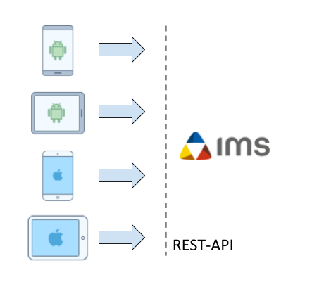

# IMS Mobile Client App

## Vision
Wir möchten es den Kunden von Imagic IMS erlauben auf einfache Weise via mobilen Clients digitale Medien (Bilder, Audio, Video, Texte) im IMS System abzuspeichern. Dazu möchten wir eine plattformunabhängige Mobile-App entwickeln.

Die Softwareentwicklung wollen wir Team durchführen. Das Software Projekt soll vom Greenfield zur Konzeption über Architektur bis hin zur Realisation durchgeführt werden.

Das Produkt soll eine generische Open Source Lösung sein, welche das Produktsortiment von IMS erweitert.

Mit Hilfe von Continuous Integration, Reviews und Tests werden wir versuchen eine hohe Softwarequalität zu erreichen, um ein einfach erweiterbares Produkt abzuliefern.

Unser persönliches Ziel ist es, unser Wissen um moderne Cross-Platform Frameworks und Tooling zu erweitern. Durch gelungenes Interaction Design möchten wir den Kunden eine Freude im Alltag bereiten. Auch möchten wir unser Leben erleichtern und eine Continuous Deployment Pipeline aufbauen, damit neue Releases rasch und einfach beim Kunden ankommen. 

Am Schluss soll eine funktional vollständige Android und iOS App entstehen, welche in einem Software Repository zum Download bereitgestellt wird. Mit dieser App sollen digitale Medien auf benutzerfreundliche Art und Weise ins IMS hochgeladen werden können um den Arbeitsalltag der Kunden zu erleichtern. 

## Allgemeine Angaben
### Autor

| Photo        | Name | E-Mail |
| ------------ | ---- | ------ |
|  |Niklaus Tschirky|niklaus.tschirky@hsr.ch|
|  |Michael Leu|michael.leu@hsr.ch|
|  |Sandro Zbinden|sandro.zbinden@hsr.ch|

## Einführung
### Zweck
Dieses Dokument beschreibt die Organisation, Vorgehensweise sowie die verwendeten Werkzeuge für die Umsetzung des Projekts. Es dient als Einstiegspunkt um sämtliche projektbezogenen Information zu finden.

### Gültigkeitsbereich
Dieses Dokument ist über die ganze Projektdauer gültig. Änderungen werden fortlaufend eingepflegt und können in der [Commit History](https://github.com/IMSmobile/app/commits/master/README.md) dieses Dokuments angesehen werden.
### Referenzen
| Link        | Beschreibung |
| ------------- |-------------|
| [Arbeitspakete (Issues)](https://github.com/IMSmobile/app/issues?utf8=%E2%9C%93&q=)      | Arbeitspakete werden als Github Issues erfasst und durch Labels kategorisiert|
| [Kanban Board](https://waffle.io/IMSmobile/app)| Waffle Kanbanboard verknüpft mit Issues zeigt Backlog und Zustand des aktuellen Sprints|
| [Zeiterfassung](https://docs.google.com/spreadsheets/d/1wPmgUyEP-KACbgbScPLBRBLKIGRuS5j_b-cGsaogbYE/edit?usp=sharing)| Google Spreadsheet Dokument zeigt Aufwand der Projektarbeit|
| [Kalender](https://calendar.google.com/calendar/embed?src=3k1v67336orm53otamk6e4s1rc%40group.calendar.google.com&ctz=Europe/Paris) | Google Calendar für die Planung einzelner Ereignissen
| [Rest Dokumentation](https://sinv-56028.edu.hsr.ch/) | Dokumentation der IMS Rest Schnittstelle

### Glossar
Siehe [Glossar](docs/glossary.md)

## Projekt Übersicht
Durch das Projekt IMS Mobile Client App entsteht eine Applikation um Medien via Mobile Devices im digitalen Bildmanagementsystem IMS zu sichern. Das Projekt wird im Rahmen einer Masterarbeit von der Hochschule für Technik in Rapperswil [HSR](www.hsr.ch) für den Studiengang MAS Softwareengineering 2015 durchgeführt.

Die Anforderungen sowie auch deren Priorisierung erfolgt in Abstimmung mit den Firmen Imagic AG und PIC System AG.

Die Firma Imagic bietet Lösungen und Systeme für das digitale Bildmanagement. Dem Kunden werden Tools für die Aufnahme, Bearbeitung, Analyse, Verwaltung und Reporting von Bildmaterial angeboten. Diverse Schnittstellen erlauben die Integration einer Vielzahl Fremdapplikationen. Die Firma PIC Systems vertreibt die Bildmanagement Lösung und ist für den Vertrieb, Installation und Instandhaltung der Software Lösung im Bereich der Polizei zuständig.

IMS ist ein sehr flexibles Bildmanagement-System, bei welchem Workflows für verschiedene Zwecke erstellt werden können. Dies erlaubt es, dieselbe Code-Basis für verschiedene Kunden-Segmente wie Industrie, Medizin, Life-Sciences und Polizei einzusetzen.

Die primäre Benutzergruppe für den mobilen Client sind schweizerische Polizeieinheiten. Der neue Client sollte einen einfacheren Prozesses bereitstellen, um Bilder während ihrem täglichen Einsatz auf Streife in ihrem IMS Bildverwaltungssystem abzulegen. Die Lösung sollte offen genug sein um sämtliche Datenmodelle von weiteren Kundensegmenten wie Medizin, Industrie und Life Science abzudecken. Als sekundäre Benutzergruppe sehen wir die Verkäufer der IMS Software, welche den Mobile Client zu Demonstrationszwecken nutzen können.

Der Mobile Client soll einen schlanken und bedienerfreundlichne Weg bieten um nebst dem herkömmlichen IMS Client Daten und den unzähligen technischen Schnittstellen (XML. HL7. Dicom) Medien in das IMS abzuspeichern.

### Lieferumfang

Am Ende des Projekts wird eine Android sowie eine iOS Applikation im Internet zum Download bereitgestellt. Ziel ist es, dass diese Applikation in den offiziellen Appstores von Google (für Android) und Apple (für iOS) öffentlich als kostenlose Applikation heruntergeladen werden kann. Jedoch gibt es keine Garantie dafür, da Applikationen von diesen Stores auch abgelehnt werden können.

Der Umfang der Applikation ist anhand der [Anforderungsanalyse](docs/spec.md) ersichtlich. Mit unseren Kunden Imagic und PIC Systems wurde abgemacht, dass die "muss" Kriterien bis zum Ende der Projektdauer erfüllt sind.

Eine Benutzerdokumentation ist nicht vorgesehen, da die Software von IMS Kunden ohne Schulung bedienbar sein sollte.

## Projektorganisation

### Ansprechpartner
Folgende Ansprechpartner stehen während dem Projekt zur Verfügung:

| Name        | Firma | Funktion |
| ------------- |-------------|-------------|
| Urs Gomez| Imagic Bildverarbeitung AG | Anforderungen Imagic AG |
| Marcel Bachmann| PIC Systems AG | Anforderungen PIC System AG |
| Roland Weber| Ergon AG | Betreuer Masterarbeit |
| Susanne Rigling | HSR | Information Masterarbeit |

### Stakeholder

Nebst dem Imagic IMS selber unterscheiden wir generell vier Stakeholdergruppen:
- **IMS Kunden**: Sie benutzen das Imagic IMS und ziehen daraus ihren Businessnutzen. Ihre Hauptmotivation ist die Möglichkeit mit ihren mobilen Geräten Bilder, Videos und andere Daten im Imagic IMS abzuspeichern.
  - **Benutzer**: Sie arbeiten mit dem Imagic IMS. Ihre Hauptmotivation ist die Erleichterung ihres Arbeitsalltags.
  - **Betreiber IT-Infrastruktur**: Sie haben die Verantwortung für die Sicherheit und Verfügbarkeit der IT beim IMS Kunden. Ihre Hauptmotivation ist die gute Verwaltbarkeit des IMS Mobile Client z.B. mit einer Mobile Device Management Software.
- **Imagic AG**: Sie entwickeln, verkaufen und supporten das Imagic IMS für Kunden und Partner wie z.B. PIC Systems. Ihre Hauptmotivation ist die Erweiterung ihres Produktportfolios um eine einfache Möglichkeit Daten von mobilen Geräten in das Imagic IMS zu speichern. 
  - **IMS Verkäufer**: Sie beraten, verkaufen und gestalten die Weiterentwicklung des Imagic IMS. Ihre Hauptmotivation ist dem Kunden eine überzeugende Lösung anbieten zu können.
  - **IMS Entwickler**: Sie entwicklen die Software. Ihre Hauptmotviation ist eine qualitativ hochwertige Codebasis.
  - **IMS Support-Abteilung**: Sie stehen den Kunden oder Partnern bei Problemen zur Seite. Ihre Hauptmotivation ist eine reibungslose Installation der Software und gute Diagnosemöglichkeit bei Problemen.
- **PIC Systems**: Sie passen das Imagic IMS an die speziellen Bedürfnisse im Polizeibereich an und supporten das Imagic IMS für ihre Kunden. Ihre Hauptmotivation ist das Entwickeln einer Lösung für den Bildupload in das Imagic IMS für den täglichen Polizeieinsatz auf Streife oder im Aussendienst.
  - **IMS Verkäufer**: Sie beraten, verkaufen und gestalten die Weiterentwicklung des Imagic IMS für den Polzeibereich. Ihre Hauptmotivation ist dem Kunden eine überzeugende Lösung anbieten zu können.
  - **Betreiber IMS Instanz**: Sie konfigurieren und pflegen die Installation des Imagic IMS bei ihren Kunden. Ihre Hauptmotivation ist eine reibungslose Funktionsweise mit dem Imagic IMS Server.
- **Stores**: Sie prüfen und publizieren Apps und erlauben damit den IMS Kunden auf einfache Weise den IMS Mobile Client auf ihren Geräten zu installieren. Ihre Hauptmotivation ist die Qualität und Sicherheit ihrer Plattform sicherzustellen.

## Risikomanagement

Die Risiken und der Umgang mit Risiken wird durch ein separates Dokument [Risiko Analyse](docs/risikoanalyse.md) beschrieben. 

## Management Abläufe

### Zeitliche Planung
Während der Projektdauer zwischen 15.02.2017 - 28.08.2017 wird das Projekt in 13 Sprints unterteilt. Jeder Sprint hat einen zeitlichen Aufwand von ca. 93 Stunden.

#### Phasen

| Phase        | Beschreibung | Zeitbereich |
| ------------- |-------------|-------------|
| Anforderungsanalyse und Prototype | Sammeln der Anforderungen von Stakeholdern, Evaluation von verschiedenen Cross-Platform Frameworks | 24.02.2017 - 24.03.2017 |
| Design und Architektur | Erstellung von Interaction Design und Architektur der Software. Einrichten der Tools für das gewählte  Crossplatframework| 24.03.2017 - 07.04.2017 |
| Implementierung | Implementierung der Anforderungen. Anpassen des Design, der Archtitektur und Anforderungen wenn Anpassungen nötig sind. Kontakt mit Stakeholder in 2 Wochen Rhythmus| 07.04.2017 - 18.08.2017 |
| Abschluss und Übergabe | Abschliessen der Dokumentation für Abgabe des Projekts, Übergabe des Projekts an Imagic | 18.08.2017 - 28.08.2017 |
| Präsentation | Vorbereitung und Durchführung der öffentlichen Präsentation | 28.08.2017 - 04.09.2017 |

## Infrastruktur
Um unabhängig von der Imagic AG Infrastruktur zu sein haben wir uns entschieden auf einer virtuellen Maschine der HSR einen eigenen Demo Imagic IMS Server zu installieren. Die IMS REST API wird gegen aussen verschlüsselt durch dem [Caddy Webserver](https://caddyserver.com/) als Reverse Proxy bereitgestellt. So erhalten wir mit minimalem Aufwand eine Umgebung ähnlich wie wir sie bei IMS Kunden erwarten würden sobald sie die IMS REST API für ihre mobilen Clients freischalten würden. Mit der Demo-Installation erhalten wir auch vorgefertigte Beispielstrukturen inkl. Daten der Bereiche Medizin, Biochemie, Industrie und Polizei.

Für die Versonsverwaltung des Quellcodes, aller projektrelevanten Dokumente, für das Issue-Tracking sowie für Reviews von Quellcode und Dokumenten nutzen wir die Plattform von GitHub.

## Qualitätsmassnahmen
<<Was wird unternommen damit das Produkt des Projektes, sowie dessen gesamter Verlauf eine hohe Qualität erreicht? Übersicht in einer Tabelle geben mit Massnahmen, Zeitraum und Ziel der Massnahme>>
### Dokumentation
Sämtliche Dokumentationen stehen im öffentlich Zugänglichen [GitHub Repository](https://github.com/IMSmobile/app/) zur Verfügung. Wie auch beim Quellcode werden allen Änderungen an einem Dokument von mindestens einer Person mithilfe eines Reviews überprüft.

### Projektmanagement
<<Welches Tool wird für Projektmanagement eingesetzt (z.B. Redmine oder Trac) und wie erfolgt dieser Einsatz? Dazugehörige Links und Logins (ohne Passwörter).>>
### Entwicklung

Das Projekt wird als Open Source Software unter der MIT Lizenz entwickelt. Der Source Code steht in einem öffentlich zugänglichen [GitHub Repository](https://github.com/IMSmobile/app/) zur Verfügung.

#### Vorgehen
Um ein rasches Kundenfeedback zu erhalten und damit wir abschlussorientiert arbeiten können, wird das Projekt mit agiler Methoden entwickelt.

Alle Entwickler der Applikation stehen hinter dem [Agilen Manifest](http://agilemanifesto.org/iso/de/manifesto.html).

**Individuen und Interaktionen** mehr als Prozesse und Werkzeuge  
**Funktionierende Software** mehr als umfassende Dokumentation  
**Zusammenarbeit mit dem Kunden** mehr als Vertragsverhandlung  
**Reagieren auf Veränderung** mehr als das Befolgen eines Plans  

Das heisst, obwohl wir die Werte auf der rechten Seite wichtig finden,
schätzen wir die Werte auf der linken Seite höher ein.

Das Prozessvorgehen orientiert sich stark an Scrum. Die meisten Events und Artefakte wurden direkt vom [Scrum Guide](http://www.scrumguides.org/scrum-guide.html) übernommen. Es gibt jedoch Abweichungen bezüglich dem Scrum Team.

#### Events

Wir führen folgende im Scrum enthaltenen Events wiederholt durch. Da wir nicht jeden Tag und auch nicht zur gleichen Zeit am Projekt arbeiten verzichten wir auf das Daily Scrum Meeting. Für die Kommunikation und Statusupdates verwenden wir Slack (Messaging System), welches Schnittstellen zu den gängigen Entwicklerplattformen bereitstellt. Wir sind bedacht, dass wir Probleme und Hindernisse frühzeitig zu kommunizieren.

| Event        | Beschreibung | Dauer |
| ------------- |-------------|-------------|
| Sprint        | Zeitdauer in welcher fokussiert an einem Ziel gearbeitet wird, welches Nutzen für den Kunden generiert.    | 2 Wochen |
| Sprint Planning| Festlegen der Arbeit für den nächsten Sprint. | 1.5 Stunden |
| Sprint Review| Demonstration der fertigen Inkremente für Stakeholder / Betreuer. | 1 Stunde |
| Sprint Retrospektive| Analyse des letzten Sprints und definieren der geplanten Verbesserungen. | 1 Stunde |

#### Artefakte
Das Product Backlog sowie der Sprint Backlog kann online in einem [Waffle Kanban Board](https://waffle.io/IMSmobile/app) angesehen werden.

| Artefakt | Beschreibung |
| ------------- |-------------|
| Product Backlog  | Anhand der Anforderungsspezifikation und später durch Kundeninput definierte Arbeitspakete|
| Sprint Backlog  | Arbeitspakete welche innerhalb eines Sprints erledigt werden.|

#### Team
Im Gegensatz zu Scrum gibt es keinen Product Owner. Die Arbeit des Product Owners wird von den Teammitgliedern gemeinsam durchgeführt. Die Anforderungen sowie auch die Priorisierung der Arbeiten wird zusammen mit den Stakeholdern definiert.

Auch verzichten wir auf die Rolle des Scrum Master. Probleme und Hindernisse werden jeweils sofort im Slack Chat gemeldet und zusammen angeschaut.

#### Code Reviews
<<Werden Code Reviews gemacht und wie werden diese gemacht?>>
#### Code Style Guideline
<<Welche Code Style Guidelines werden angewendet? Sie brauchen keine eigenen Guidelines zu erfinden. Am besten referenzieren Sie existierende Guidelines, mit denen Sie einverstanden sind. Evtl. noch Abweichungen dazu dokumentieren.>>
<<Framework-Abhängig>>
### Testing
TBD
<<Framework-Abhängig>>
#### Unit Testing
TBD
<<Framework-Abhängig>>
#### End to End Testing
TBD
<<Framework-Abhängig>>
#### Manual Testing
TBD
<<Framework-Abhängig>>

## Quellen
Icons von https://icons8.com/
