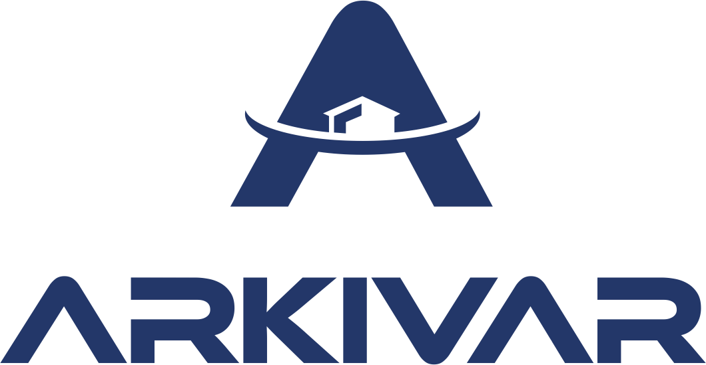

<h1 align="center">
  
</h1>
<h3 align="center">Mobiler Client für Imagic IMS</h4>

## Projektdokumente

| Dokument          | Beschreibung                                                         |
|-------------------|----------------------------------------------------------------------|
| [Eigenständigkeitserklärung](docs/eigenstaendigkeitserklaerung.pdf)     | Bestätigung der Eigenleistung                                            |
| [Projektantrag](docs/projektantrag.pdf)     | Zeigt Inhalt und Genehmigung des Projekts                                            |
| [Projektplanung](docs/projektplan.md)    | Details zum Projekt und Projektvorgehen                              |
| [Protokolle](docs/protokolle.md)        | Zusammenfassungen von Sitzungen über Teilnehmer, Inhalt und Aktionen |
| Testspezifikation | Resultat der explorativer Testsession                                |
| [Zeiterfassung](docs/zeiterfassung.pdf)     | Liste aller Stunden                                                  |
| [Zeitauswertung](docs/zeitauswertung.pdf)    | Verbrauchte Stunden pro Sprint und Kategorie                         |
| [Abstrakt](docs/abstract.md)          | Kurzbeschreibung des Projekts                                        |
| Schlussbericht    | Feedback und Abschluss des Projekts                                  |
| [Glossar](docs/glossary.md)           | Beschreibung des Projektwortschatz                                   |

## Produktdokumente

| Dokument                            | Beschreibung                                                  |
|-------------------------------------|---------------------------------------------------------------|
| [Fragekatalog](docs/questions.md)                        | Fragen um initiale Anforderung zu ergänzen                    |
| [Anforderungspezifikation](docs/spec.md)            | Gewünschte Anforderungen und ihre Priorität                   |
| [Risikonanalyse](docs/risikoanalyse.md)                      | Risiken des Projekts und Risikominimierung                    |
| [Framework-Anforderungsspezifikation](docs/frameworkanforderungen.md) | Anforderung für eine Frameworkevaluation                      |
| [Framework-Entscheid](docs/Frameworkentscheid.md)              | Beschreibung weshalb Framework ausgewählt wurde                |
| [Architekur-Designdokumentation](docs/sad.md)      | Hilfe für Entwickler sich rasch im Projekt zurecht zu finden  |
| [Decisionlog](docs/decisionlog.md)                         | Entscheidungen die während dem Projekt entstanden sind        |
| [Grafik Update](docs/howToUpdateGraphics.md)                       | Beschreibung wie Logo und Icons gewechselt werden können         |
| [Marketing Text](docs/store/store.md)                      | Text welcher für App-Store und Play-Store verwendet wird     |
| [Sprint Dokumente](docs/sprints.md)                       | Präsentationen, Protokolle und Burndown Charts der Sprints |

## Quellen
Icons von https://icons8.com/

## Markenrechte
Imagic IMS ist eine eingetragene Marke der [Klasse](https://de.wikipedia.org/wiki/Markenklassifikation) 09 und darf nur mit der ausdrücklichen Erlaubnis von Imagic Bildverarbeitung AG verwendet werden.
