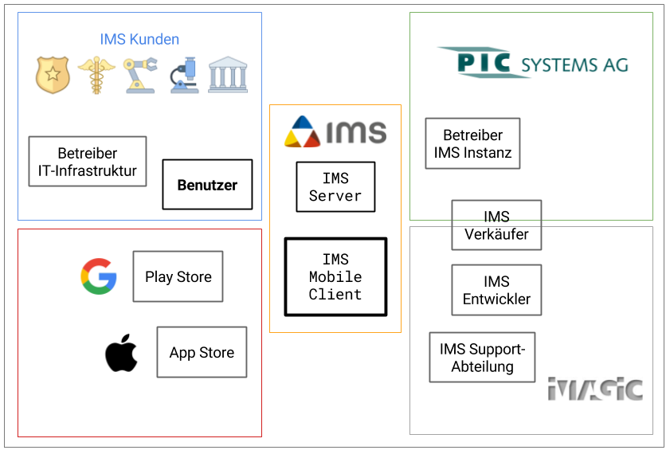
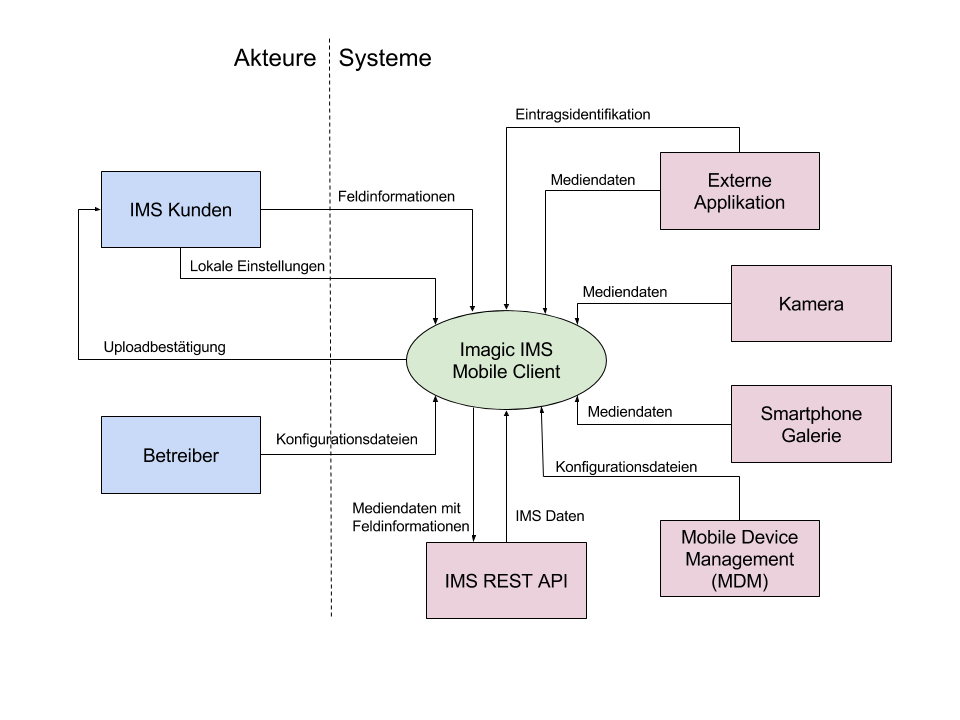
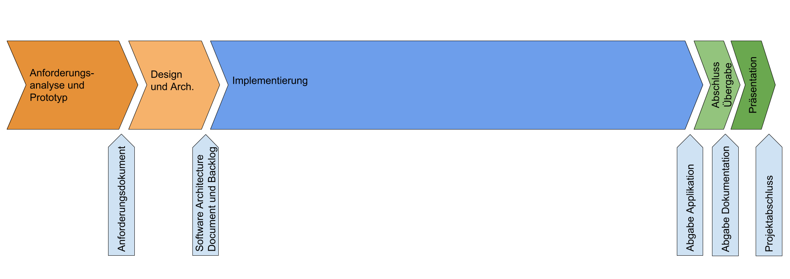

# Projektplan

## Inhaltsverzeichnis

- [Vision](#vision)
- [Allgemeine Angaben](#allgemeine-angaben)
  - [Autor](#autor)
- [Einführung](#einführung)
  - [Zweck](#zweck)
  - [Gültigkeitsbereich](#gültigkeitsbereich)
  - [Referenzen](#referenzen)
  - [Glossar](#glossar)
- [Projektübersicht](#projektübersicht)
  - [Lieferumfang](#lieferumfang)
  - [Kostenvorgabe](#kostenvorgabe)
- [Projektorganisation](#projektorganisation)
  - [Ansprechpartner](#ansprechpartner)
  - [Stakeholder](#stakeholder)
- [Kontextdiagramm](#kontextdiagramm)
- [Personas / Test Accounts](#personas--test-accounts)
- [Risikomanagement](#risikomanagement)
- [Management Abläufe](#management-abläufe)
  - [Zeitliche Planung](#zeitliche-planung)
    - [Phasen](#phasen)
- [Infrastruktur](#infrastruktur)
- [Qualitätsmassnahmen](#qualitätsmassnahmen)
  - [Framework](#framework)
  - [Dokumentation](#dokumentation)
  - [Projektmanagement](#projektmanagement)
  - [Entwicklung](#entwicklung)
    - [Entwicklungs Setup](#entwicklungs-setup)
      - [IMS Rest Konfiguration](#ims-rest-konfiguration)
      - [Entwicklungsumgebung](#entwicklungsumgebung)
        - [Plugins](#plugins)
        - [Debugging](#debugging)
    - [Vorgehen](#vorgehen)
    - [Events](#events)
    - [Artefakte](#artefakte)
    - [Team](#team)
    - [Code Reviews](#code-reviews)
    - [Code Coverage](#code-coverage)
    - [Code Guideline](#code-guideline)
    - [Commit Message Guidelines](#commit-message-guidelines)
  - [Testing](#testing)
    - [Jasmine](#jasmine)
    - [Karma](#karma)
    - [Unit Testing](#unit-testing)
    - [End to End Testing](#end-to-end-testing)
    - [Build Testing](#build-testing)
    - [Continuous Integration](#continuous-integration)
    - [Manual Testing](#manual-testing)
  - [Releasing](#releasing)
  - [Versionierung](#versionierung)
  - [Wireframes](#wireframes)
  - [Story Map](#story-map)

## Vision
Wir möchten es den Kunden von Imagic IMS erlauben, auf einfache Weise via mobilen Clients digitale Medien (Bilder, Audio, Video, Texte) im Imagic IMS System abzuspeichern. Dazu möchten wir eine plattformunabhängige Mobile-App entwickeln.


Die Softwareentwicklung wollen wir im Team durchführen. Das Software Projekt soll vom Greenfield zur Konzeption über Architektur bis hin zur Realisation durchgeführt werden.

Das Produkt soll eine generische Open Source Lösung sein, welche das Produktsortiment von IMS erweitert.

Mit Hilfe von Continuous Integration, Reviews und Tests werden wir versuchen, eine hohe Softwarequalität zu erreichen, um ein einfach erweiterbares Produkt abzuliefern.

Unser persönliches Ziel ist es, unser Wissen um moderne Cross-Platform Frameworks und Tooling zu erweitern. Durch gelungenes Interaction Design möchten wir den Kunden eine Freude im Alltag bereiten. Auch möchten wir unser Leben erleichtern und eine Continuous Deployment Pipeline aufbauen, damit neue Releases rasch und einfach beim Kunden ankommen. 

Am Schluss soll eine funktional vollständige Android und iOS App entstehen, welche in einem Store zum Download bereitgestellt wird. Mit dieser App sollen digitale Medien auf benutzerfreundliche Art und Weise ins IMS hochgeladen werden können, um den Arbeitsalltag der Kunden zu erleichtern.


## Allgemeine Angaben
### Autorschaft

|  |  |  |
| -- | -- | -- |
| Michael Leu | Niklaus Tschirky | Sandro Zbinden |


## Einführung
### Zweck
Dieses Dokument beschreibt die Organisation, Vorgehensweise sowie die verwendeten Werkzeuge für die Umsetzung des Projekts. Es dient als Einstiegspunkt, um sämtliche projektbezogenen Information zu finden.

### Gültigkeitsbereich
Dieses Dokument ist über die ganze Projektdauer gültig. Änderungen werden fortlaufend eingepflegt und können in der [Commit History](https://github.com/IMSmobile/app/commits/master/docs/projektplan.md) dieses Dokuments angesehen werden.

### Referenzen
| Link        | Beschreibung |
| ------------- |-------------|
| [Arbeitspakete (Issues)](https://github.com/IMSmobile/app/issues?utf8=%E2%9C%93&q=)      | Arbeitspakete werden als Github Issues erfasst und durch Labels kategorisiert|
| [Kanban Board](https://waffle.io/IMSmobile/app)| Waffle Kanban Board verknüpft mit Issues zeigt Backlog und Zustand des aktuellen Sprints|
| [Burn Up Chart](https://docs.google.com/spreadsheets/d/1xm9ytSJTCfuZGIuy3rtBODxPf5nHPiAcZkGWlJf7iIY/edit?usp=sharing) | Zeigt auf, wieviel wir bis Projektende voraussichtlich erreichen werden |
| [Zeiterfassung](https://docs.google.com/spreadsheets/d/1wPmgUyEP-KACbgbScPLBRBLKIGRuS5j_b-cGsaogbYE/edit?usp=sharing)| Google Spreadsheet Dokument zeigt Aufwand der Projektarbeit|
| [Kalender](https://calendar.google.com/calendar/embed?src=3k1v67336orm53otamk6e4s1rc%40group.calendar.google.com&ctz=Europe/Paris) | Google Calendar für die Planung einzelner Ereignisse |
| [REST API Dokumentation](https://sinv-56028.edu.hsr.ch/) | Dokumentation der IMS REST Schnittstelle |
| [IMS Publisher Police](http://sinv-56028.edu.hsr.ch:40000/ims_publisher_police/) | IMS Publisher mit konfiguriertem Polizeiarchiv |
| [IMS Publisher Medicine](http://sinv-56028.edu.hsr.ch:40000/ims_publisher_medicine/) | IMS Publisher mit konfiguriertem Medizinarchiv |
| [Continuous Integration Server](https://travis-ci.org/IMSmobile/app) | Travis Continuous Integration Test Server mit Log |
| [Wireframes](https://ninjamock.com/s/CM1BL) | Wireframes des Mobile Client |
| [Story Map](https://realtimeboard.com/app/board/o9J_k0HGAYQ=/) | Überblick über sämtliche User-Storys |

### Glossar
Siehe [Glossar](glossary.md)

## Projektübersicht
Im Rahmen des Projekts _Arkivar – Mobile Client for Imagic IMS_ entsteht eine Applikation, um Medien via Mobile Devices im digitalen Bildmanagementsystem von Imagic IMS zu sichern. Das Projekt wird im Rahmen einer Masterarbeit von der Hochschule für Technik in Rapperswil [HSR](https://www.hsr.ch/de/) für den Studiengang MAS Software-Engineering 2015-2017 durchgeführt.

Die Anforderungen sowie auch deren Priorisierung erfolgt in Abstimmung mit den Firmen Imagic AG und PIC Systems AG.

Die Firma Imagic bietet Lösungen und Systeme für das digitale Bildmanagement. Dem Kunden werden Tools für die Aufnahme, Bearbeitung, Analyse, Verwaltung und Reporting von Bildmaterial angeboten. Diverse Schnittstellen erlauben die Integration einer Vielzahl Fremdapplikationen. Die Firma PIC Systems vertreibt die Bildmanagement-Lösung und ist für den Vertrieb, die Installation und Instandhaltung der Software-Lösung im Bereich der Polizei zuständig.

Imagic IMS ist ein sehr flexibles Bildmanagement-System, bei welchem Workflows für verschiedene Zwecke erstellt werden können. Dies erlaubt es, dieselbe Code-Basis für verschiedene Kunden-Segmente wie Industrie, Medizin, Life-Sciences und Polizei einzusetzen.

Die primäre Benutzergruppe für den Mobile Client sind schweizerische Polizeieinheiten. Die neue App sollte einen einfacheren Prozess bereitstellen, um Bilder während ihrem täglichen Einsatz auf Streife in ihrem IMS Bildverwaltungssystem abzulegen. Die Lösung sollte offen genug sein, um sämtliche Datenmodelle von weiteren Kundensegmenten wie Medizin, Industrie und Life Science abzudecken. Als sekundäre Benutzergruppe sehen wir die Verkäufer der IMS Software, welche den Mobile Client zu Demonstrationszwecken nutzen können.

Der Mobile Client soll einen schlanken und bedienerfreundlichen Weg bieten, um nebst dem herkömmlichen IMS Client Daten und den unzähligen technischen Schnittstellen (XML, HL7, Dicom uvm.) Medien im Imagic IMS abzuspeichern.

### Lieferumfang

Am Ende des Projekts wird eine Android sowie eine iOS Applikation im Internet zum Download bereitgestellt. Ziel ist es, dass diese Applikation in den offiziellen Appstores von Google (für Android) und Apple (für iOS) öffentlich als kostenlose Applikation heruntergeladen werden kann. Jedoch gibt es keine Garantie dafür, da Applikationen von diesen Stores auch abgelehnt werden können.

Der Umfang der Applikation ist anhand der [Anforderungsanalyse](spec.md) ersichtlich. Mit unseren Kunden Imagic und PIC Systems wurde abgemacht, dass die "muss" Kriterien bis zum Ende der Projektdauer erfüllt sind.

Zusätzlich zur Applikation wird eine Entwicklerdokumentation abgegeben. Durch diese Dokumentation wird sichergestellt, dass zukünftige Entwickler das Projekt einfach aufsetzen und sämtliche Tools für die Entwicklung verstehen.

Eine Benutzerdokumentation ist nicht vorgesehen, da die Software von IMS Kunden ohne Schulung bedienbar sein sollte. 

### Kostenvorgabe

Das Projekt wird von der Firma Imagic AG und PIC Systems AG finanziell unterstützt. Sämtliche Ausgaben werden erst nach Absprache getätigt.

## Projektorganisation

Unsere Auftraggeber sind sowohl die Imagic AG wie auch die PIC Systems AG. Imagic AG beauftragt uns, eine möglichst generische Lösung für sämtliche Einsatzbereiche zu entwickeln, während unsere enge Zusammenarbeit mit PIC Systems AG sicherstellt, dass der Mobile Client für den täglichen Einsatz im Polizeibereich geeignet sein wird.

### Ansprechpartner
Folgende Ansprechpartner stehen während dem Projekt zur Verfügung:

| Name        | Firma | Funktion |
| ------------- |-------------|-------------|
| Urs Gomez| Imagic Bildverarbeitung AG | Anforderungen Imagic AG |
| Marcel Bachmann| PIC Systems AG | Anforderungen PIC System AG |
| Roland Weber| Ergon AG | Betreuer Masterarbeit |
| Susanne Rigling | HSR | Information Masterarbeit |

### Stakeholder


Nebst dem Imagic IMS selber unterscheiden wir generell vier Stakeholdergruppen:
- **IMS Kunden**: Sie benutzen das Imagic IMS und ziehen daraus ihren Business Nutzen. Ihre Hauptmotivation ist die Möglichkeit, mit ihren mobilen Geräten Bilder, Videos und andere Daten im Imagic IMS abzuspeichern.
  - **Benutzer**: Sie arbeiten mit dem Imagic IMS. Ihre Hauptmotivation ist die Erleichterung ihres Arbeitsalltags.
  - **Betreiber IT-Infrastruktur**: Sie haben die Verantwortung für die Sicherheit und Verfügbarkeit der IT beim IMS Kunden. Ihre Hauptmotivation ist die gute Verwaltbarkeit des Mobile Client z.B. mit einer Mobile Device Management Software.
- **Imagic AG**: Sie entwickeln, verkaufen und supporten das Imagic IMS für Kunden und Partner wie z.B. PIC Systems. Ihre Hauptmotivation ist die Erweiterung ihres Produktportfolios, um eine einfache Möglichkeit zu bieten, Daten von mobilen Geräten in das Imagic IMS zu speichern. 
  - **IMS Verkäufer**: Sie beraten, verkaufen und gestalten die Weiterentwicklung des Imagic IMS. Ihre Hauptmotivation ist dem Kunden eine überzeugende Lösung anbieten zu können.
  - **IMS Entwickler**: Sie entwickeln die Software. Ihre Hauptmotivation ist eine qualitativ hochwertige Codebasis zu erhalten.
  - **IMS Support-Abteilung**: Sie stehen den Kunden oder Partnern bei Problemen zur Seite. Ihre Hauptmotivation ist eine reibungslose Installation der Software und gute Diagnosemöglichkeiten bei Problemen.
- **PIC Systems**: Sie passen das Imagic IMS an die speziellen Bedürfnisse im Polizeibereich an und supporten das Imagic IMS für ihre Kunden. Ihre Hauptmotivation ist das Entwickeln einer Lösung für den Bildupload in das Imagic IMS für den täglichen Polizeieinsatz auf Streife oder im Aussendienst. Sie vertreten auch die rechtlichen Vorgaben und Sicherheitsanforderungen ihrer Kunden. 
  - **IMS Verkäufer**: Sie beraten, verkaufen und gestalten die Weiterentwicklung des Imagic IMS für den Polizeibereich. Ihre Hauptmotivation ist dem Kunden eine überzeugende Lösung anbieten zu können.
  - **Betreiber IMS Instanz**: Sie konfigurieren und pflegen die Installation des Imagic IMS bei ihren Kunden. Ihre Hauptmotivation ist eine reibungslose Funktionsweise mit dem Imagic IMS Server.
- **Stores**: Sie prüfen und publizieren Apps und erlauben damit den IMS Kunden auf einfache Weise den Mobile Client auf ihren Geräten zu installieren. Ihre Hauptmotivation ist die Qualität und Sicherheit ihrer Plattform sicherzustellen.


## Kontextdiagramm

Das Kontextdiagramm zeigt auf, dass sich der Mobile Client mit mehreren Umgebungskomponenten austauscht. Er wird durch den Betreiber oder durch ein Mobile Device Management System (MDM) mit Hilfe von Konfigurationsdateien parametrisiert. Lokale Einstellungen kann der Benutzer selber vornehmen. Die Mediendaten (Bilder, Filme) werden durch die Galerie, Kamera oder durch eine externe Applikation bereitgestellt. Die externe Applikation kann ausserdem Daten für eine Eintragsidentifikation mitschicken. Der Benutzer wählt die Mediendaten aus und schickt sie mit Feldinformationen versehen weiter über den Mobile Client an die REST-Schnittstelle. Die REST-Schnittstelle bietet ausserdem Daten zur Navigation und Strukturierung für eine korrekte Datenablage im IMS Server.

## Personas / Test Accounts

Um ein besseres Bild der Benutzer des Mobile Clients zu erhalten und auch um mit verschiedenen Benutzern zu testen wurden Personas erstellt. Diese Accounts existieren auf dem Testserver und man kann sich mit dem aufgelisteten Username und Password einloggen.

| Vorname | Nachname   | Firma                    | Funktion                   | Archive                    | Gruppen                | Username | Password    |
|---------|------------|--------------------------|----------------------------|----------------------------|------------------------|----------|-------------|
| Luca    | Habbicht   | Imagic AG                | IMS Verkäufer Medizin      | ims_med_test               | Verkauf                | luca     | freshwinter |
| Petko   | Atanasov   | Imagic AG                | Support / Installation IMS | ims_med_test, workflow_db1 | Betrieb, Administrator | petko    | crazybone   |
| Getraud | Schuttmann | Picsystem AG             | Betreiber IMS Instanz      | workflow_db1               | Betrieb, Administrator | getraud  | keenbird    |
| Mia     | Giese      | Kantonspolizei | Detektivin Einbruch        | workflow_db1               | Upload_Benutzer        | mia      | bigshape    |
| Lorenz  | Mayer      | Kantonspolizei | Polizist in Ausbildung     | workflow_db1               | Ansicht_Benutzer       | lorenz   | whiteplant  |
| Jožica  | Grigorov   | Kantonspolizei | Leitung Polizeikorps       | workflow_db1               | Betrieb, Administrator | jožica   | megagame    |
| Felizia | Montera    | Kantonspolizei | Innendienst                | workflow_db1               | Nicht_App_Benutzer     | felizia  | graypaper   |

Die Personas sind verschiedenen Gruppen zugeteilt, welche wiederum unterschiedliche Berechtigungen haben.

| IMS Gruppe         | Administrator | Bilder Upload | Fälle erstellen | Fälle ansehen | Mobile Client benutzen |
|--------------------|---------------|---------------|-----------------|---------------|------------------------|
| Betrieb            | Ja            | Ja            | Ja              | Ja            | Ja                     |
| Verkauf            | Nein          | Ja            | Ja              | Ja            | Ja                     |
| Upload_Benutzer    | Nein          | Ja            | Ja              | Ja            | Ja                     |
| Ansicht_Benutzer   | Nein          | Nein          | Nein            | Ja            | Ja                     |
| Nicht_App_Benutzer | Nein          | Nein          | Nein            | Nein          | Nein                   |

## Risikomanagement

Die Risiken und der Umgang mit Risiken wird durch ein separates Dokument [Risiko Analyse](risikoanalyse.md) beschrieben. 

## Management Abläufe

### Zeitliche Planung
Während der Projektdauer zwischen 15.02.2017 - 28.08.2017 wird das Projekt in 13 Sprints unterteilt. Jeder Sprint hat einen zeitlichen Aufwand von ca. 93 Stunden.

#### Phasen

| Phase        | Beschreibung | Zeitbereich |
| ------------- |-------------|-------------|
| Anforderungsanalyse und Prototype | Sammeln der Anforderungen von Stakeholdern, Evaluation von verschiedenen Cross-Platform Frameworks | 24.02.2017 - 24.03.2017 |
| Design und Architektur | Erstellung von Interaction Design und Architektur der Software. Einrichten der Tools für das gewählte Cross-Platform Framework| 24.03.2017 - 07.04.2017 |
| Implementierung | Implementierung der Anforderungen. Anpassen des Design, der Architektur und Anforderungen. Kontakt mit Stakeholdern in 2 Wochen Rhythmus| 07.04.2017 - 18.08.2017 |
| Abschluss und Übergabe | Abschliessen der Dokumentation für Abgabe des Projekts, Übergabe des Projekts an Imagic | 18.08.2017 - 28.08.2017 |
| Präsentation | Vorbereitung und Durchführung der öffentlichen Präsentation | 28.08.2017 - 04.09.2017 |



## Infrastruktur
Um unabhängig von der Imagic AG Infrastruktur zu sein, haben wir uns entschieden auf einer virtuellen Maschine der HSR einen eigenen Demo Imagic IMS Server zu installieren. Die IMS REST API wird gegen aussen verschlüsselt durch den [Caddy Webserver](https://caddyserver.com/) als Reverse Proxy bereitgestellt. So erhalten wir mit minimalem Aufwand eine Umgebung ähnlich wie wir sie bei IMS Kunden erwarten würden sobald sie die IMS REST API für den mobilen Einsatz freischalten würden. Mit der Demo-Installation erhalten wir auch vorgefertigte Beispielstrukturen inkl. Daten der Bereiche Medizin, Biochemie, Industrie und Polizei.

Für die Versionsverwaltung des Quellcodes, aller projektrelevanten Dokumente, für das Issue-Tracking sowie für Reviews von Quellcode und Dokumenten nutzen wir die Plattform von GitHub.

## Qualitätsmassnahmen

Unsere Qualitätsmassnahmen umfassen folgende Punkte:

| Massnahme                                                 | Zeitraum                                   | Typ             | Ziel
| --------------------------------------------------------- | ------------------------------------------ | --------------- | ----
| Erfassen sämtlicher Aufgaben als Issues                   | Gesamte Projektdauer                       | organisatorisch | Übersicht und Nachverfolgbarkeit der Tätigkeiten
| Mind. ein Review nötig vor dem Mergen eines Pull Requests | Gesamte Projektdauer (ausser bei Prototyp) | analytisch      | Qualität des Quellcodes sicherstellen und Verteilung von Know-How
| Reviews priorisieren vor neuen Arbeiten                   | Gesamte Projektdauer (ausser bei Prototyp) | organisatorisch |  Frühzeitige Verifikation des Quellcodes
| Bau mehrerer Prototypen mit unterschiedlichen Frameworks  | Anforderungsanalyse und Prototyp          | konstruktiv     | Technische Risiken ausschliessen
| Product Backlog                                           | Gesamte Projektdauer                       | organisatorisch | Priorisierung der Aufgaben
| Sprint Reviews                                            | Gesamte Projektdauer                       | organisatorisch | Prüfung auf Akzeptanz der Stakeholder
| Sprint Retrospektiven                                     | Gesamte Projektdauer                       | organisatorisch | Kontinuierliche Verbesserung der Arbeitsweise
| Definition of Done                                        | Ab Phase Implementierung                   | organisatorisch | Einigkeit über Qualitätsanforderungen einer Aufgabe
| Anforderungen unter Test stellen                          | Ab Phase Implementierung                   | konstruktiv     | Sicherstellung der Funktionsweise
| Defects unter Test stellen                                | Ab Phase Implementierung                   | konstruktiv     | Regressionen vermeiden
| End to End Tests                                          | Ab Phase Implementierung                   | konstruktiv     | Funktion der Module untereinander sicherstellen
| Unit Tests                                                | Ab Phase Implementierung                   | konstruktiv     | Architektureinhaltung und Dokumentation
| Pflegen eines Glossars                                    | Gesamte Projektdauer                       | organisatorisch | Missverständnisse vermeiden
| Quellcode und Dokumentations unter Versionsverwaltung     | Gesamte Projektdauer                       | organisatorisch | Änderungskontrolle und Nachverfolgbarkeit
| Wireframes                                                | Gesamte Projektdauer (ausser bei Prototyp) | analytisch      | Prüfung auf Akzeptanz der Stakeholder
| Story Map                                                 | Gesamte Projektdauer (ausser bei Prototyp) | organisatorisch | Übersicht behalten

### Framework
Für die Entwicklung der Software benutzen wir das Framework [Ionic](http://ionicframework.com/).
Die Anforderungen an das Framework wurden in einem speziell dafür geschaffenen [Anforderungskatalog](frameworkanforderungen.md) festgehalten. Drei Prototypen wurden erstellt und gegen die Anforderungen geprüft. Die Auswahl des Frameworks kann im Dokument [Framework Entscheid](Frameworkentscheid.md) nachgelesen werden.  

| Framework   | Prototype   |
|---|---|
| Ionic | https://github.com/IMSmobile/ionic2-prototype   |
| Xamarin  | https://github.com/IMSmobile/XamarinPrototype  |
| React Native | https://github.com/IMSmobile/rn-prototype   |

                    

### Dokumentation
Sämtliche Dokumentationen stehen im öffentlich zugänglichen [GitHub Repository](https://github.com/IMSmobile/app/) zur Verfügung. Wie auch beim Quellcode werden alle Änderungen an einem Dokument von mindestens einer Person mithilfe eines Reviews überprüft.

### Projektmanagement
Sämtliche Aufgaben werden als Issues im [GitHub Repository](https://github.com/IMSmobile/app/issues) erfasst und erscheinen automatisch auf dem [Waffle Kanban Board](https://waffle.io/IMSmobile/app) in der Spalte *Backlog*. Während dem Sprint Planning ordnen und schätzen wir alle Issues im Waffle und versehen sie mit Labels, um die Quelle und Art der Aufgabe zu deklarieren. Anschliessend ziehen wir die Issues, für welche wir uns bis zum nächsten Sprint zur Umsetzung verpflichten, in die Spalte *Sprint Backlog*.

Unsere Arbeitsergebnisse werden über einen GitHub Pull Request abgeliefert. Im Kommentar des Pull Requests referenzieren wir eines oder mehrere Issues, welche damit abgeschlossen sind. Dadurch werden die verknüpften Issues auf dem Kanban Board automatisch in die Spalte *Needs Review* verschoben und es ist für alle im Team ersichtlich, dass ein prüfbares Arbeitsergebnis vorliegt.

Nach Abschluss des Reviews wird der Pull Request mit einem Merge in den *master Branch* abgeschlossen und das Issue wird automatisch in die Spalte *Done* verschoben.

Am Sprintende werden die Issues in der Spalte *Done* kurz besprochen und über die Waffle Archivfunktion auf dem Kanban Board ausgeblendet.

In der Sprint Retrospektive arbeiten wir mit dem [Fun Retro Board](http://funretro.github.io/distributed/), um eine kontinuierliche Verbesserung unserer Arbeitsweise zu erreichen.

Dank dem [Burn Up Chart](https://docs.google.com/spreadsheets/d/1xm9ytSJTCfuZGIuy3rtBODxPf5nHPiAcZkGWlJf7iIY/edit?usp=sharing) können wir laufend eine Aussage darüber machen, was wir bis Projektende voraussichtlich erreichen werden resp. für welche Aufgaben keine Zeit mehr bleiben wird. Dies hilft uns auch zusammen mit den Stakeholdern die verbleibenden Aufgaben richtig zu priorisieren.

### Entwicklung

Das Projekt wird als Open Source Software unter der MIT Lizenz entwickelt. Der Source Code steht in einem öffentlich zugänglichen [GitHub Repository](https://github.com/IMSmobile/app/) zur Verfügung.

#### Entwicklungs Setup
Um neuen Entwicklern einen schnellen Start ins Projekt zu ermöglichen, wurde eine [Schnellstartanleitung](schnellstartanleitung.md) mit den gängigsten Befehlen geschrieben.

##### IMS Rest Konfiguration
Damit der Mobile Client mit einem Imagic IMS funktioniert muss mindestens ein Filter mit dem Namen **IMS_Mobile_Client** existieren.  

##### Entwicklungsumgebung
Zur Entwicklung von Ionic brauchen wir [Visual Studio Code](https://code.visualstudio.com/).

###### Plugins
Um besser mit Ionic arbeiten zu können, müssen folgende Plugins der Entwicklungsumgebung installiert werden.

| Plugin      | Befehl | Beschreibung |
|---------|-------------|--------|
|[Ionic 2 Commands with Snippets](https://marketplace.visualstudio.com/items?itemName=Thavarajan.ionic2) | `ext install ionic2` | Ionic Code Completion       |
| [Debugger for Chrome](https://marketplace.visualstudio.com/items?itemName=msjsdiag.debugger-for-chrome) | `ext install debugger-for-chrome` | Javascript und Typescript Debugging via Google Chrome |
|[TSLint](https://marketplace.visualstudio.com/items?itemName=eg2.tslint) | `ext install tslint` | Integration des [tslint Linters](#code-guideline) für TypeScript |
|[Markdown TOC](https://marketplace.visualstudio.com/items?itemName=AlanWalk.markdown-toc) | `ext install markdown-toc` | Automatisiertes generieren des Inhaltsverzeichnis (Table of Content) für Markdown Dateien. |
|[Auto Import](https://marketplace.visualstudio.com/items?itemName=steoates.autoimport) | `ext install autoimport` | Automatisches importieren von Klassen in Typescript via Code Completion.

###### Debugging
Um eine Ionic App zu debuggen:
1. Chrome schliessen
2. In Visual Studio Code `Ctrl + P` und in Suchfeld: `> Ionic Serve Options` eingeben und ausführen (inklusive `>`)
3. Shortcut `F5` drücken

#### Vorgehen
Um ein rasches Kundenfeedback zu erhalten und damit wir abschlussorientiert arbeiten können, wird das Projekt mit agilen Methoden entwickelt.

Alle Entwickler der Applikation stehen hinter dem [Agilen Manifest](http://agilemanifesto.org/iso/de/manifesto.html).

**Individuen und Interaktionen** mehr als Prozesse und Werkzeuge  
**Funktionierende Software** mehr als umfassende Dokumentation  
**Zusammenarbeit mit dem Kunden** mehr als Vertragsverhandlung  
**Reagieren auf Veränderung** mehr als das Befolgen eines Plans  

Das heisst, obwohl wir die Werte auf der rechten Seite wichtig finden, schätzen wir die Werte auf der linken Seite höher ein.

Das Prozessvorgehen orientiert sich stark an Scrum. Die meisten Events und Artefakte wurden direkt vom [Scrum Guide](http://www.scrumguides.org/scrum-guide.html) übernommen. Es gibt jedoch Abweichungen bezüglich dem Scrum Team.

#### Events

Wir führen folgende, im Scrum enthaltene, Events wiederholt durch. Da wir nicht jeden Tag und auch nicht zur gleichen Zeit am Projekt arbeiten, verzichten wir auf das Daily Scrum Meeting. Für die Kommunikation und Statusupdates verwenden wir Slack (Messaging System), welches Schnittstellen zu den gängigen Entwicklerplattformen bereitstellt. Wir sind bedacht, dass wir Probleme und Hindernisse frühzeitig kommunizieren.

| Event        | Beschreibung | Dauer |
| ------------- |-------------|-------------|
| Sprint        | Zeitdauer, in welcher fokussiert an einem Ziel gearbeitet wird, welches Nutzen für den Kunden generiert.    | 2 Wochen |
| Sprint Planning| Festlegen der Arbeit für den nächsten Sprint. | 1.5 Stunden |
| Sprint Review| Demonstration der fertigen Inkremente für Stakeholder / Betreuer. | 1 Stunde |
| Sprint Retrospektive| Analyse des letzten Sprints und Definieren der geplanten Verbesserungen. | 1 Stunde |

#### Artefakte
Das Product Backlog sowie der Sprint Backlog können online im [Waffle Kanban Board](https://waffle.io/IMSmobile/app) angesehen werden.

| Artefakt | Beschreibung |
| ------------- |-------------|
| Product Backlog  | Anhand der Anforderungsspezifikation und später durch Kundeninput definierte Arbeitspakete.|
| Sprint Backlog  | Arbeitspakete, welche innerhalb eines Sprints erledigt werden.|

#### Team
Im Gegensatz zu Scrum gibt es keinen Product Owner. Die Arbeit des Product Owners wird von den Teammitgliedern gemeinsam durchgeführt. Die Anforderungen sowie auch die Priorisierung der Arbeiten werden zusammen mit den Stakeholdern definiert.

Auch verzichten wir auf die Rolle des Scrum Masters. Probleme und Hindernisse werden jeweils sofort im Slack Chat gemeldet und zusammen angeschaut.

#### Code Reviews

Wir arbeiten nach [GitHub Flow](https://guides.github.com/introduction/flow/) und haben unser Repository so eingestellt dass bei einem Pull Request zwingend ein Review einer zweiten Person nötig ist bevor der Code in den Master Branch einfliessen kann.

Bei einem Review möchten wir
- Überprüfen ob alle Punkte der Definition of Done eingehalten wurden
- Den Code und nicht den Autor des Codes kritisieren
- Unsere Kommentare positiv und lösungsorientiert formulieren
- Mit Geduld und Respekt mit Unwissen umgehen
- Auch Lob aussprechen, um die Arbeit des Anderen wertzuschätzen

Damit die Wartezeit möglichst kurz gehalten wird, haben Reviews von einem Pull Request immer Priorität gegenüber dem Beginn einer neuen Aufgabe. Ausserdem dürfen kleinere Fehler ohne Rücksprache mit dem Autor selbständig vom Reviewer behoben werden.

#### Code Coverage 
Mit Code Coverage können wir sicherstellen, dass der Code in einem Test ausgeführt wurde. Die Code Coverage wird automatisch mit jedem Travis Build ausgeführt und kann danach online in [coveralls](https://coveralls.io/github/IMSmobile/app) angesehen werden. Eine lokale Code Coverage kann mit folgendem Befehl ausgeführt werden.
```shell
npm run test-coverage
```


#### Code Guideline

Mit [codelyzer](https://github.com/mgechev/codelyzer) und [tslint](https://palantir.github.io/tslint/) wird der Quellcode automatisch gegen Code Guidelines geprüft. Das [default Ruleset für Guidelines](https://github.com/driftyco/tslint-ionic-rules) vom Ionic Team wurde als Standard übernommen und um weitere Rules erweitert, um eine höhere Codequalität zu erreichen.

Mit folgendem Befehl kann eine Prüfung durchgeführt werden.
```shell
npm run lint
```

#### Commit Message Guidelines
Um eine saubere und lesbare Commit History zu erhalten verwenden wir Commit Message Guidelines. Diese Guidelines wurden von den [Angular Commit Message Guidelines](https://github.com/angular/angular/blob/master/CONTRIBUTING.md#commit) übernommen und angepasst. Die genauen Commit Regeln werden in der [Definition of Done](../CONTRIBUTING.md) beschrieben.

### Testing
Um eine hohe Qualität zu erreichen und um Fehler nicht zu wiederholen, werden alle Anforderung und Defects unter Tests gestellt. Automatisierte Tests sind zu bevorzugen, da diese ohne menschlichen Aufwand immer wieder ausgeführt werden können. Ist ein automatisierter Test nicht möglich oder zu komplex, werden manuelle Test Cases erstellt. Auch für die wichtigsten Smoke Tests werden manuelle Testcases geschrieben.

Bei jedem Release müssen alle automatisierten und manuellen Tests durchgeführt werden. Gibt es Fehler, muss diskutiert werden, ob diese als Showstopper einen Release verhindern. Falls die Fehler keinen Release verhindern, müssen sie in den Release Notes beschrieben werden.

#### Jasmine
Um automatisierte Tests zu schreiben, brauchen wir das JavaScript Framework [jasmine](https://jasmine.github.io/).

#### Karma

Um automatisierte Tests auszuführen, benutzen wir das Framework  [Karma](https://karma-runner.github.io/1.0/index.html). Diese Tool startet einen Webbrowser (Google Chrome) und führt die JavaScript Tests direkt auf dem Webbrowser aus. Dort wird auch direkt das Resultat der Tests dargestellt. Zudem erkennt Karma Codeänderungen und führt im Hintergrund alle benötigten Tests automatisch aus.

#### Unit Testing
Unit Tests dienen dazu sicherzustellen dass eine Klasse modular gebaut ist und wiederverwendet werden kann. Zudem dienen Unit Tests als Dokumentation der Klasse. Das Ausführen aller Unit Tests darf nicht länger als 30 Sekunden dauern.

Mit folgendem Befehl können Unit Tests ausgeführt werden.
```shell
npm test
```

Hier ein abstraktes Beispiel eines Unit Tests. Weitere Beispiele findet man in der jasmine [Dokumentation](https://jasmine.github.io/2.0/introduction.html)

```javascript
describe("A module ", function() {
  it("contains spec with an expectation", function() {
    expect(true).toBe(true);
  });
  it("contains spec with another expectation", function() {
    expect(true).toBe(true);
  });
});
```

#### End to End Testing
Bei End to End Testing werden Anforderungen automatisiert getestet. Es wird sichergestellt dass die Integration und Zusammenarbeit der verschiedenen Komponenten funktioniert. Diese Tests dauern in der Regel länger und sollen von einem Continuous Integration Server automatisiert ausgeführt werden.

Mit folgendem Befehl können alle End to End Tests ausgeführt werden.

```shell
npm run e2e
```

End to End Tests werden mit dem [Protractor Framework](http://protractor.com/) durchgeführt. Damit ein lesbarer und wiederverwendbarer Testcode entsteht wird das Page Object Pattern eingesetzt.

Hier ein Beispiel eines End to End Tests:

```javascript
describe('Settings E2E Test', () => {

  const entriesPage = new EntriesPageObject();
  const settingEntriesFieldsPage = new SettingEntriesFieldsPageObject();

  it('Should show only selected field', () => {
    settingEntriesFieldsPage.loadPage();
    Helpers.toggleFieldSettings(settingEntriesFieldsPage.settingsEntriesFieldMEMOFELDToggle);
    entriesPage.reloadPage();
    entriesPage.verifyFirstFieldName('MEMOFELD');
    entriesPage.verifyOnlyFirstFieldsVisible();
  });

});
```
#### Build Testing
Mit Build Testing stellen wir sicher, dass unsere Software in ein gültiges Paketformat (`.ipa` oder `.apk`) für Smartphones umgewandelt werden kann. Dazu verwenden wir den Service [Ionic Package](https://docs.ionic.io/services/package/).

Mit folgenden Befehlen kann ein Build für Android sowie iOS gestartet und verifiziert werden:

```shell
ionic package build android --noresources --profile dev
ionic package build ios --noresources --profile dev
ionic package list
```

#### Continuous Integration
Mit der Hilfe von Travis CI wird nach einem Push auf GitHub automatisch eine Continuous Integration durchgeführt. Diese umfasst das Durchführen von Unit Tests, End to End Test, Linterüberprüfung, Code Coverage und einen automatischen Build für iOS und Android. Im Falle eines Pull Requests wird zusätzlich zum Push eine mit dem Master Branch zusammengemergte Version getestet. Nur wenn sämtliche Tests ohne Fehler durchgeführt wurden, darf der Pull Request gemerged werden.  

Das Ergebnis der Continuous Integration wird grafisch in GitHub sowie auf unserem Kanbanboard angezeigt. Bei Bedarf kann auch der Log der Tests auf der Travis-Website eingesehen werden.

Dank dieses Tools ist es möglich, eine stabile und unabhängige Testumgebung zu entwickeln und mit wenig Aufwand zu betreiben. Sie kombiniert die Tests mit einem automatischen Build und nimmt durch die Automatisierung viele manuelle Arbeitsschritte ab.

#### Manual Testing
Nicht alle Fehler können durch Unit und End to End Testing gefunden werden. Für eine Prüfung der Darstellung auf den Referenzgeräten im Vergleich zu den Wireframes sind noch immer manuelle Tests nötig. Daher wird jedes neue Feature manuell auf einem iOS und Android Gerät getestet.

Um während der Entwicklung einen raschen Testzyklus auf iOS-Geräten zu erreichen setzen wir den Service [Ionic View](http://view.ionic.io/) ein. Mit folgenden Befehlen kann die Software für Ionic View paketiert und hochgeladen werden:
```shell
npm run ionic:build
ionic upload
```
Anschliessend kann die soeben hochgeladene Software-Version sofort innerhalb des Ionic View auf einem Smartphone überprüft werden.

Zum Projektabschluss wurde zusätzlich eine explorative Testsession mit zwei Test Charters durchgeführt:
1. *Explore Settings with Web Browser, iPhone and Android Phone to discover persistency or concurrency errors*
2. *Explore Upload with Web Browser, iPhone and Android Phone to discover field validation*

Mithilfe des Tools [Rapid Reporter](http://testing.gershon.info/reporter/) wurde der Ablauf sowie alle Entdeckungen im [Protokoll der Testsession](testsession/sessionreport.md) festgehalten.

### Releasing
Um rasch neue Versionen des Clients bereitstellen zu können setzen wir auf die standardisierte Versionierung mit [Semantic Versioning](http://semver.org/) sowie die automatisierte Erstellung von Release Notes mit [Conventional Changelog](https://github.com/conventional-changelog/conventional-changelog).

Dabei wird in einem ersten Schritt die Relevanz der Änderung anhand des [Commit Message Formats](#commit-message-guidelines) beurteilt und die Versionsnummer entsprechend erhöht. Anschliessend werden die Release Notes generiert und der Release freigegeben.

Für die [Versionierung](#versionierung) relevant sind nur Commit Messages vom [Typ](../CONTRIBUTING.md#type) `fix`, `feature` oder `perf` sowie Breaking Changes. Es ist Aufgabe des Reviewers nach dem Mergen solcher Pull Requests die Erstellung eines neuen Releases anzustossen mit dem Befehl: 

```shell
npm run release
```

Mit diesem Kommando wird  die neue Versionsnummer erstellt und automatisch aktualisiert, eine Markierung (`tag`) für die Versionsverwaltung erstellt sowie die aktualisierte Sammlung aller Release Notes ([`CHANGELOG.md`](../CHANGELOG.md)) generiert.

Anschliessend wird diese Änderung vom Reviewer direkt auf dem Master Branch committed. Dafür muss temporär der Schutz des Master Branches auf GitHub aufgehoben werden.

Nach dem Commit muss der Reviewer den Schutz sofort wieder aktivieren und den Release unter der entsprechenden Versionsnummer auf GitHub bereitstellen.

### Versionierung
Eine Version nach Semantic Versioning besteht aus den drei Komponenten _MAJOR_, _MINOR_ und _PATCH_, welche je nach Commit Message Typ inkrementiert werden.

| Versionskomponente | Commit Message Typ | Beispiel
| ------------------ | ------------------ | ---------
| _MAJOR_ | Breaking Changes | Neue Anforderungen an die Version des Imagic IMS Servers 
| _MINOR_ | `feature`        | Neu lassen sich auch Videos hochladen 
| _PATCH_ | `fix`            | Fehlerbehebung beim Upload grosser Bilder

### Wireframes
Mit Hilfe von Wireframes skizzieren wir die Benutzeroberfläche und stellen die Abläufe dar. Sie dienen als Basis für die Entwicklung des User Interface und der Navigation zwischen den verschiedenen Screens. Um unsere Wireframes interaktiv bedienbar zu machen benutzen wir [NinjaMock](https://ninjamock.com).

|  |  |  |  |
|--------------------------------------|--------------------------------------|--------------------------------------|-------------------------------------|

### Story Map
Aus den Anforderungen und dem laufenden Feedback der Stakeholder entstehen User-Storys welche wir nach Themen gruppiert als Kärtchen auf der Story Map auslegen. Während dem Sprint Review zeigen wir jeweils den aktuellen Stand des Projekts bezogen auf die User-Storys.

