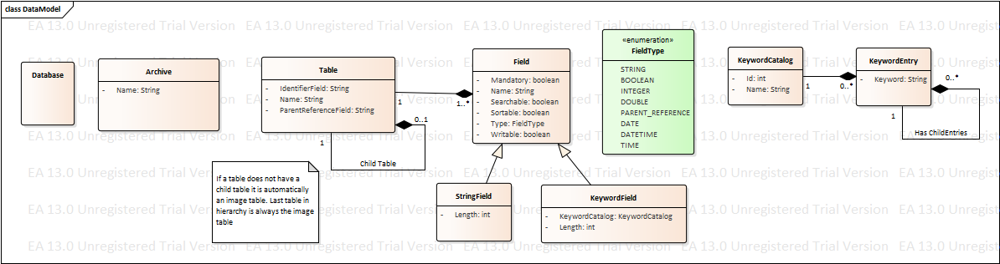
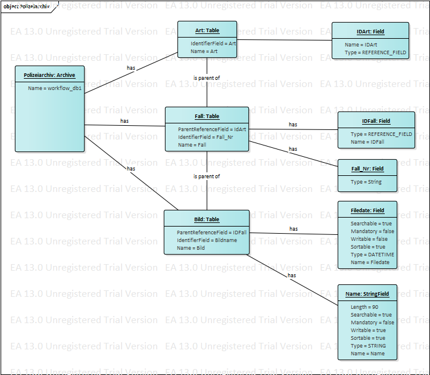
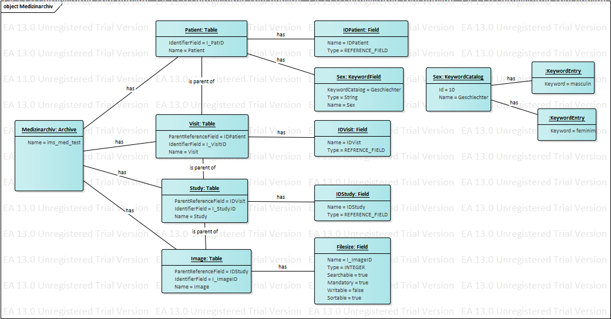

# Software Architecture Document

Beschreibt die Archtiektur der IMS Mobile App.

## Imagic Daten Model
Um im IMS Daten via Rest API zu speichern müssen wir uns mit dem Datenmodell der Firma Imagic vertraut machen.
Da Imagic Software für verschiedene Kundensegement programmiert ist das Datenmodell sehr abstrakt.

### Datenmodell

Innerhalb einer IMS Datenbank können verschiedene **Archive** installiert sein. Jedes dieser Archive kann unterschiedliche Tabellen (**Table**) mit wiederum unterschiedlichen Felder (**Field**) haben. Die Tabellen sind hierarchisch in einer 1:n Struktuer aufgebaut. Die letzte Kind Tabelle ist jeweils die Bilder Tabelle. Auf dieser Ebene werden alle Mediendaten gespeichert und sie ist zwingend. Alle Tabellen besitzen zwingend neben IMS spefizischen Felder ein vom Kunden definitertes IdentifierField. Dieses wird für eine eindeutige Identifiaktion gebraucht.

Neben normalen Felder (String, Boolean, Integer usw.) gibt es noch ein speziellers Keyword Feld. Dies ist ein Feld welches String Werte abspeichern kann. Diese Werte sollten jedoch aus einem Katalog geholt werden.

### Objektmodell
Mit dem Objektmodell wird aufgezeigt, wie unterschiedlich Tabellen und Felder bei einem Archive sein können. Als Beispiel dient ein Auszug aus einem Polizeiarchiv und einem Medizinarchiv.

Das Polizeiarchiv workflow_db1 hat drei Tabellen. Auf der höchsten Ebene steht die Tabelle Art. Danach kommen Fälle und zu jedem Fall gibt es Bilder.

Das Medizinarchiv beinhaltet ganz andere Tabellen. Auf höchster Ebene ist dort ein Patient, danach kommen Besuche (Visit), Studien (Study) und am Schluss wie von IMS vorgegeben die Bilder Tablelle. Als Beispiel eines Keyword Katalog wurde das Geschlecht (Sex) bei einem Patient genommen. Man erkennt das innerhalb des Keyword Kataloges die Werte masculin und feminim ausgewählt werden können.

