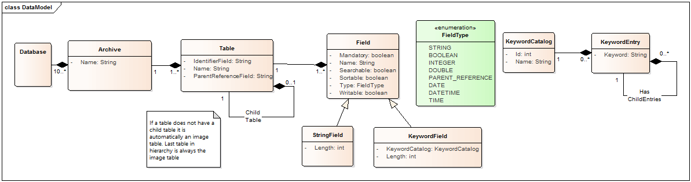
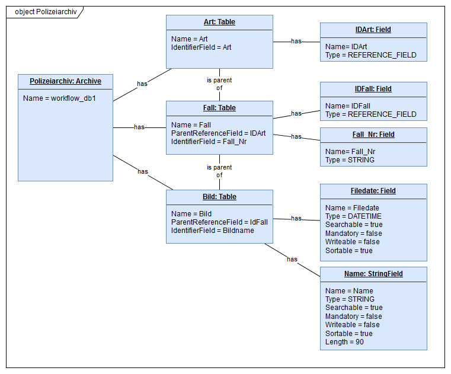
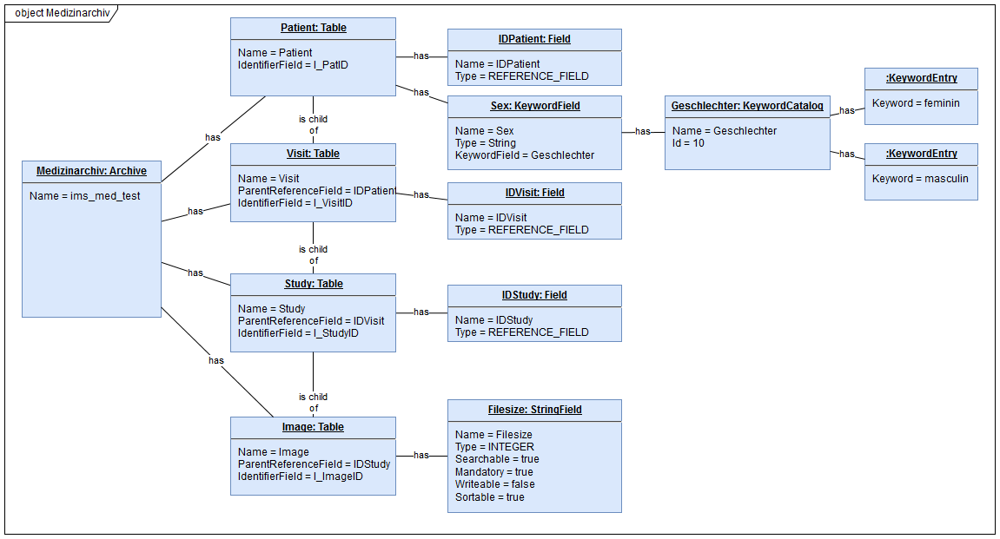

# Software Architecture Document

Beschreibt die Archtiektur des IMS Mobile Client.

## Imagic IMS Daten Model
Um im Imagic IMS Daten via REST API zu speichern müssen wir uns mit dem Datenmodell der Firma Imagic vertraut machen.
Da das Imagic IMS für verschiedene Kundensegement flexibel einsetzbar sein muss ist das Datenmodell sehr abstrakt.

### Datenmodell

Innerhalb einer IMS Datenbank können verschiedene **Archive** installiert sein. Jedes dieser Archive kann unterschiedliche Tabellen (**Table**) mit wiederum unterschiedlichen Feldern (**Field**) haben. Die Tabellen sind hierarchisch in einer 1:n Struktur aufgebaut. Die letzte Kind Tabelle wird jeweils als Bilder Tabelle bezeichnet. Auf dieser Ebene werden alle Mediendaten gespeichert und sie ist damit zwingend. Alle Tabellen besitzen zwingend neben IMS spezifischen Felder ein vom Kunden definitertes IdentifierField. Dieses wird für eine eindeutige Identifikation der Objekte durch den Kunden gebraucht.

Neben normalen Feldern (String, Boolean, Integer usw.) gibt es noch ein speziellers Keyword Feld. Dies ist ein Feld welches String Werte abspeichern kann. Diese Werte sollten jedoch aus einem Katalog geholt werden.

### Objektmodell
Mit dem Objektmodell wird aufgezeigt, wie unterschiedlich Tabellen und Felder bei einem Archive sein können. Als Beispiel dient ein Auszug aus einem Polizeiarchiv und einem Medizinarchiv.

Das Polizeiarchiv workflow_db1 hat drei Tabellen. Auf der höchsten Ebene steht die Tabelle Art. Danach kommen Fälle und zu jedem Fall gibt es Bilder.

Das Medizinarchiv beinhaltet völlig andere Tabellen. Auf höchster Ebene ist dort ein Patient, danach kommen Besuche (Visit), Studien (Study) und am Schluss wie von IMS vorgegeben die Bilder Tabelle. Als Beispiel eines Keyword Katalog wurde das Geschlecht (Sex) bei einem Patient gewählt. Man erkennt dass innerhalb des Keyword Kataloges die Werte masculin und feminim ausgewählt werden können.

## Ordner Struktur Konventionen

Damit das Projekt sauber strukturiert ist und sich neue Entwickler rasch zurechtfinden verwenden wir Order Struktur Konventionen. Diese Konventionen entsprechen im Grundsatz der Konvention von einem Ionic 2 Projekt.   
    .
    ├── docs                         # Dokumentationen
    ├── resources                    # Icon, Splashscreen
    |── scripts                      # Scripts für Travis CI oder Installationen
    ├── src                          # Sourcecode Files
    ├──── app                        # Zusammenstellung der App, Depdency Managment Konfiugration
    ├──── assets                     # Bilder die innerhalb der App gebraucht werden
    ├──── mocks                      # Mocks und Klassen für Testing
    ├──── models                     # Model Klassen
    ├──── pages                      # UI Screen Seiten
    ├────── anyPage                  # Überordner einer Seite
    ├──────── any-page.html          # Struktur und UI Elemente der Seite
    ├──────── any-page.scss          # Gestaltung der Seite
    ├──────── any-page.spec.ts       # Testklasse der Seite
    ├──────── any-page.ts            # Logik für der Seite. Aufrufe von Services
    ├──── providers                  # Services welche innerhalb der Pages gebraucht werden können
    ├──────── any-service.spec.ts    # Testklasse des Services
    ├──────── any-service.ts         # Serviceklasse
    ├──── themes                     # scss Files für die Gestaltung der App 
    ├── e2e                          # Automatisierte End to End Tests

