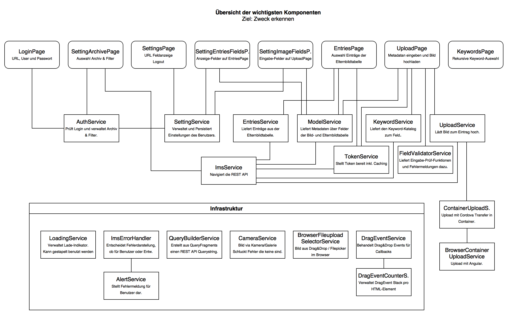
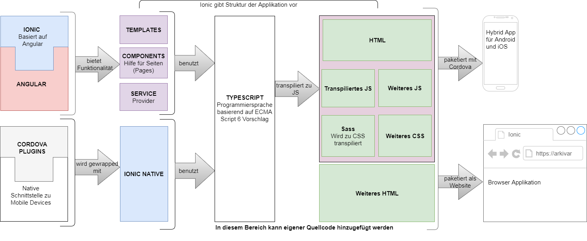

# Software Architecture Document


  - [Komponentendiagramm](#komponentendiagramm)
  - [Imagic IMS Daten Model](#imagic-ims-daten-model)
    - [Datenmodell](#datenmodell)
    - [Objektmodell](#objektmodell)
  - [Ordner Struktur Konventionen](#ordner-struktur-konventionen)
  - [Data Flow Diagramm](#data-flow-diagramm)
  - [Technologie](#technologie)
    - [Technologie Stack](#technologie-stack)
    - [Assembly Flow](#assembly-flow)

Dieses Dokument beschreibt die Architektur des Mobile Client.

## Komponentendiagramm



Der Mobile Client besteht aus mehreren **Pages**, welche wiederum auf **Services** zugreifen. Dabei unterscheiden wir zwischen Imagic IMS spezifischen **Services** und allgemeinen **Infrastruktur Komponenten**.
Die Verbindungen zeigen die Abhängigkeiten untereinander auf. Infrastruktur Komponenten sind in sich geschlossen und können unabhängig genutzt werden.
Die Reihenfolge der Pages entspricht einem typischen Ablauf von Login, Konfiguration und Upload.

Auf die Darstellung der **Models** und **Mocks** wurde aus Gründen der Übersichtlichkeit verzichtet.

## Imagic IMS Daten Model
Um im Imagic IMS Daten via REST API zu speichern, müssen wir uns mit dem Datenmodell der Firma Imagic vertraut machen.
Da das Imagic IMS für verschiedene Kundensegemente flexibel einsetzbar sein muss, ist das Datenmodell sehr abstrakt.

### Datenmodell


Innerhalb einer IMS Datenbank können verschiedene **Archive** installiert sein. Jedes dieser Archive kann unterschiedliche Tabellen (**Table**) mit wiederum unterschiedlichen Feldern (**Field**) haben. Die Tabellen sind hierarchisch in einer 1:n Struktur aufgebaut. Die letzte Kind Tabelle wird jeweils als Bilder Tabelle bezeichnet. Auf dieser Ebene werden alle Mediendaten gespeichert und sie ist damit zwingend. Alle Tabellen besitzen zwingend neben IMS spezifischen Felder ein vom Kunden definiertes IdentifierField. Dieses wird für eine eindeutige Identifikation der Objekte durch den Kunden gebraucht.

Neben normalen Feldern (String, Boolean, Integer usw.) gibt es noch ein spezielles Keyword Feld. Dies ist ein Feld, welches String Werte abspeichern kann. Diese Werte sollten jedoch aus einem Katalog geholt werden.

### Objektmodell
Mit dem Objektmodell wird aufgezeigt, wie unterschiedlich Tabellen und Felder bei einem Archive sein können. Als Beispiel dient ein Auszug aus einem Polizeiarchiv und einem Medizinarchiv.


Das Polizeiarchiv workflow_db1 hat drei Tabellen. Auf der höchsten Ebene steht die Tabelle Art. Danach kommen Fälle und zu jedem Fall gibt es Bilder.


Das Medizinarchiv beinhaltet völlig andere Tabellen. Auf höchster Ebene ist dort ein Patient, danach kommen Besuche (Visit), Studien (Study) und am Schluss, wie von IMS vorgegeben, die Bilder Tabelle. Als Beispiel eines Keyword Katalogs wurde das Geschlecht (Sex) bei einem Patienten gewählt. Man erkennt, dass innerhalb des Keyword Kataloges die Werte masculin und feminin ausgewählt werden können.

## Design Prinzipien

Die Design Prinzipien beschreiben die wichtigsten architektonischen Richtlinien und Design Patterns. Sie helfen einem Entwickler bestehende Lösungen zu übernehmen und einen Einheitlichen Code zu erhalten. 

### Ordnerstruktur Konventionen

Damit das Projekt sauber strukturiert ist und sich neue Entwickler rasch zurechtfinden, verwenden wir eine Ordnerstruktur Konvention. Diese entsprechen im Grundsatz den Konventionen eines Ionic 2 Projekts.  

    .
    ├── e2e                          # Automatisierte End to End Tests
    ├── docs                         # Dokumentationen
    ├── resources                    # Icon, Splashscreen
    |── scripts                      # Scripts für Travis CI oder Entwickler
    ├── src                          # Sourcecode Files
    ├──── app                        # Zusammenstellung der App, Dependency Managment Konfiguration
    ├──── assets                     # Bilder, die innerhalb der App gebraucht werden
    ├──── components                 # Wiederverwendbare UI Elemente
    ├────── any-component            # Überordner eines Elements
    ├──────── any-component.html     # Struktur und UI des Elements
    ├──────── any-component.scss     # Gestaltung des Elements
    ├──────── any-component.spec.ts  # Testklasse des Elements
    ├──────── any-component.ts       # Logik für das Element
    ├──── mocks                      # Mocks und Klassen für Testing
    ├────── providers                # Mock Klassen von Provider
    ├────── response                 # Mock-Antworten der REST API
    ├──── models                     # Model Klassen
    ├──── pages                      # UI Screen Seiten
    ├────── any-page                 # Überordner einer Seite
    ├──────── any-page.html          # Struktur und UI Elemente der Seite
    ├──────── any-page.scss          # Gestaltung der Seite
    ├──────── any-page.spec.ts       # Testklasse der Seite
    ├──────── any-page.ts            # Logik der Seite. Aufrufe von Services
    ├──── providers                  # Services, welche innerhalb der Pages gebraucht werden können
    ├──────── any-service.spec.ts    # Testklasse des Services
    ├──────── any-service.ts         # Serviceklasse
    ├──── themes                     # scss Files für die Gestaltung der App 
    ├──── validators                 # Validationsklassen für unterschiedliche Feldtypen

### Model

Ein Model ist eine Klasse mit Attributen, welche Informationen beinhalten. Model Klassen werden hauptsächlich für die Repräsentation der Rückgabewerte von der REST Schnittstelle und für Error Klassen eingesetzt. 

Ein wichtigeR Designentscheid ist, dasS Model Klassen **keine Methoden** haben. Dies weil beim Mapping einer Angular HTTP Response ein Model nicht automatisch Instanziert wird. Das folgende Beispiel gibt zwar Credentials zurück, jedoch ist das Objekt keine Instanz von Credential, somit können nur auf Attribute nicht aber auf Methoden zugegriffen werden.  

```typescript
  public getCredential(): Observable<Credential> {
   this.http.get('rest/info').map(response => response.json());
  } 
}
``` 

Mit dem **readonly** Modifier bei Attributen wird sichergestellt das Model Klasse Immutable sind. 

Ein Beispiel einer Model Klasse.

```typescript
export class Credential {
  public readonly username: string;
  public readonly password: string;
  
  constructor(string, password: string) {
    this.username = username;
    this.password = password;
  }
}
```


### Blockierende Aktionen

Für blockierende Aktionen, bei welchen der Benutzer auf ein Ereignis wartet, wird der LoadingService verwendet. Der LoadingService zeigt ein modales `Bitte Warten Popup` bis ein Observable abgeschlossen ist.

Das Codebeispiel zeigt die Verwendung des LoadingService.

```typescript
Observable<Response> responseObservable = this.http.get('http://slowloadingside.com')
loadingService.subscribeWithLoading(responseObservable, 
  response => { successMethod(response) }, 
  err => { throw new ImsLoadingError('Homepage', err) },
  () => { finishedMethod();});
```
### Fehlerbehandlung

Bei unerwartet Ereignissen wie z.B. Netzwerk-Unterbruch Fehlkonfiguration der Rest Schnittstelle oder falschem Programmcode kümmert sich die ImsErrorHandler Klasse um die korrekte Verarbeitung.

Im Prodkutivbetrieb zeigt der ImsErrorHandler dem Benutzer ein `Fehlermeldungs Popup` mit einer nicht technischen Fehlermeldung an. Im Entwicklungsbetrieb wird die Standard Ionic Error Seite mit Stacktraces geladen.

Damit im Produktivbetrieb die richtige Fehlermeldung angezeigt werden kann müssen alle Observables im Fehlerfall eine von ImsError geerbte Exception werfen.

```typescript
loadingService.subscribeWithLoading(responseObservable, 
  response => { successMethod(response) }, 
  err => { throw new ImsLoadingError('Homepage', err) });
```

Beispiel einer ImsError implementation. Der erste Parameter im Konstruktor ist die Fehlermeldung welche dem Kunden im Produktivbetrieb angezeigt wird.

```javascript
import { ImsError } from './ims-error';
export class ImsLoadingError extends ImsError {

  constructor(wantedToLoad: string, message: string) {
    super('Fehler beim Laden der ' + wantedToLoad, message);
    Object.setPrototypeOf(this, ImsLoadingError.prototype);
  }
}
```


## Data Flow Diagramm


Ein Data Flow Diagramm bietet einen Überblick über die Richtung des Datenflusses und zeigt auf, wo die Daten persistiert werden. Beim Arkivar Mobile Clients liefert der IMS Server alle Informationen, welche für den Aufbau der Navigationsstruktur notwendig sind. Die Bilder können von verschiedenen Quellen eingelesen werden und mit Feldeinträgen vom User komplettiert werden. Beim Upload werden die Bilder mit den Feldinformationen vom Mobile Client an den IMS Server übertragen. 

## Technologie

### Technologie Stack

Folgende Technologien werden innerhalb des Projekts verwendet:

| Kategorie                            | Technologie        | Logo                            | Link                                    |
|--------------------------------------|--------------------|---------------------------------|-----------------------------------------|
| Framework                            | Ionic              |  | http://ionicframework.com/              |
| Framework                         | Angular            |  | https://angular.io/                     |
| Programmiersprache                   | Typescript         |  | https://www.typescriptlang.org          |
| Unit Testing                         | Jasmine            |  | https://jasmine.github.io/              |
| End To End Testing                   | Protractor         |  | http://www.protractortest.org/        |
| Code Coverage                   | Coveralls         |  | https://coveralls.io/        |
| Wireframes                   | Ninja Mock         |  | https://ninjamock.com/        |
| Versionsverwaltungstool              | Git                |  | https://git-scm.com/                    |
| Hoster Versionsverwaltungstool       | GitHub             |  | https://github.com/                     |
| Build Tool                           | npm                |  | https://www.npmjs.com/                  |
| Continuous Integration               | Travis CI          |  | https://travis-ci.org/                  |
| Project Management, Bugtracking Tool | Waffle             |  | https://waffle.io/                      |
| Dokumentationstool                   | GitHub             |  | https://github.com/                     |
| Team Kommunikation                   | Slack              |  | https://slack.com/                      |
| Entwicklungsumgebung                 | Visual Studio Code |  | https://code.visualstudio.com/          |
| Zeiterfassung                        | Google Drive       |  | https://drive.google.com/ |

### Assembly Flow
Der Assembly Flow zeigt die Module und verschiedenen Technologien auf, welche gebraucht werden, um eine Ionic App zu bauen.



Ionic basiert auf Angular und bietet weitere Funktionen wie Templates, Komponenten und vorgefertigte Providers. Ausserdem gibt es die Struktur vor und ist zuständig für das Verbinden der Komponenten. Für die Smartphone-Anbindung werden Cordova-Plugins verwendet, damit auch die nativen Betriebssystemfunktionen (z.B. Kamera) benutzt werden können. Zur Einbindung dieser Ionic-Funktionen wird Typescript genutzt, welches die Grundlage für den eigenen Code ist. Dieser kann erweitert werden durch HTML und Sass. Auch ist es möglich, fremdes Javascript oder HTML zu verwenden. Das komplette Paket kann anschliessend zu einem App für verschiedene mobile Betriebssysteme oder zu einer Browser Applikation kompiliert werden.
