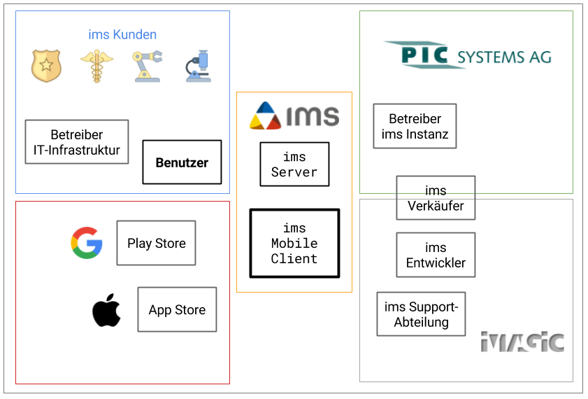

# Spezifikation ims Mobile Client

## Einleitung
Mit dem ims Mobile Client möchten wir den Kunden von Imagic ermöglichen über iOS und Android Smartphones digitale Medien (Bilder, Audio, Video, Texte) ins digitalen Bildmanagement-System Imagic ims abzuspeichern.

Als Schnittstelle soll die von Imagic ims Server bereitgestellte REST-API verwendet werden.

## Vision
*tbd*

## Stakeholder

## Anforderungskatalog
### Funktional
ID   | Name | Beschreibung | Priorität | Quelle      | Status
---- | ---- | ------------ | --------- | ----------- | ------
FA1  | Bildupload | Der Client muss bis zu 20 :warning: Bilder aus der Galerie in das Imagic ims speichern können. | muss | PIC Systems | Maximalanzahl noch abzuklären
FA2  | Kameraupload | Der Client muss ein Bild direkt von der Kamera des Smartphones in das Imagic ims speichern können.
FA3  | Bildformat | Der Client muss die Bildformate PNG und JPEG in das Imagic ims speichern können. 
FA4  | Metadaten | Der Client muss das Bild inkl. EXIF-Daten ins das Imagic ims speichern können.
FA5  | Bildbeschreibung | Nach Auswahl der Bilder muss der Client dem Benutzer die Möglichkeit bieten eine Beschreibung dazu zu erfassen
FA6  | Fallauswahl | Der Client muss dem Benutzer die Möglichkeit bieten einen bestehenden Fall auszwählen | | PIC Systems
FA7  | Fallerstellung | Der Client muss dem Benutzer die Möglichkeit bieten einen neuen Fall zu erstellen | | PIC Systems
FA8  | Falldaten | Bei der Erstellung eines neuen Falles soll der Client dem Benutzer nur die erforderlichen Felder für die Fallerstellung anzeigen. | | PIC Systems | 
FA9  | Strukturtiefe | Eine Fallauswahl oder Fallerstellung muss in einer bis zu 5 :warning: Ebenen tiefen Struktur möglich sein. | | Imagic | 
FA10 | Lizenz | Der Client muss sich an die Benutzerbegrenzung der REST-API gemäss Imagic ims Lizenzmodell halten. | | 
FA11 | iOS-muss | Der Client muss auf iPhone *tbd* mit iOS 10 :warning: funktionsfähig sein. | | | Referenzgerät definieren
FA12 | iOS-soll | Der Client soll auf iPhones mit iOS 8 :warning: oder höher funktionsfähig sein. | | | 
FA13 | Android-muss | Der Client muss auf Smartphone *tbd* mit Android *tbd* API Level *tbd* :warning: funktionsfähig sein. | | | Referenzgerät definieren
FA14 | Android-soll | Der Client soll auf Smartphones mit Android 5.1 API Level 22 :warning: oder höher funktionsfähig sein. | | | 
FA15 | Browser | Der Client kann auch mit einem modernen :warning: Browser benutzt werden. | | Imagic | Modern genauer definieren
FA16 | Direktupload | Der Client kann so eingestellt werden dass keine Mediendaten auf dem Gerät zwischengespeichert werden | | PIC Systems | 
FA17 | Schnittstelle | Der Client muss mit dem Imagic ims über die REST-API kommunizieren. | | Imagic ims |
FA18 | Entrypoint | Der Client soll über den REST-API Eingangspunkt die Ressourcen der API ansprechen. | | Imagic ims |

### Nicht-Funktional
ID   | Name | Beschreibung | Priorität | Quelle      | Status
---- | ---- | ------------ | --------- | ----------- | ------
NF1  | Design | Die Gestaltung des Clients soll die Design-Guidelines von Android und iOS erfüllen | | |
NF2  | Publisher | Der Client soll von einem Privat- oder Firmenkonto in den Appstore publiziert werden können. | | Google und Apple | 
NF3  | Kompabilität | Der Client soll nur mit bestimmten Versionen der REST-API funktionieren | | |
NF4  | Selbsterklärend | Der Client soll durch einen Benutzer welcher mit der Bedienung von Imagic ims vertraut ist ohne Schulung bedient werden können. | | |
NF5  | Offline | Der Client soll auch ohne Netzwerkverbindung zur REST-API *tbd* können. | | | Funktionaltiät definieren in #26
NF6  | Verschlüsselung | Der Client soll verschlüsselt mit der REST-API kommunizieren. | | |
NF7  | Deployment | Der Client kann durch ein Mobile Device Management von zentraler Stelle aus durch den IT-Verantwortlichen installiert, aktualisiert und deinstalliert werden. | | |
NF8  | Zentralkonfig | Der Client kann durch ein Mobile Device Managment z.B. mit Configuration Profile von zentraler Stelle aus durch den IT-Verantwortlichen konfiguriert werden. | | |
NF9  | PIN-Code | Der Client kann nur genutzt werden wenn das Smartphone mit einer Sicherheits-Sperre (PIN-Code, Fingerabdruck etc) gegen Nutzung durch Drittpersonen geschützt ist. | | |
NF10 | Opensource | Der Quellcode des Clients soll frei zugänglich und von verschiedenen Firmen nutzbar sein | | |
NF11 | Version | Im Client soll die Version ersichtlich sein | | Support-Abteilung |
NF12 | Wartezeiten | Der Client soll den Benutzer über Wartezeiten beim Upload oder API-Abfragen informieren | | Benutzer |
NF13 | Abbruch | Aktionen welche länger als 10 :warning: Sekunden dauern sollen vom Benutzer abgebrochen werden können. || Benutzer |
NF14 | Fallanzahl | Der Client soll mit einem Imagic ims funktionieren welches 50'000 Fälle beinhaltet. | | PIC Systems |

## Glossar

Begriff | Bedeutung
------- | ---------
Client | ims Mobile Client, die Software welche wir entwickeln
Imagic | Imagic Bildverarbeitung AG, Hersteller des Imagic ims
Imagic ims | Bildmanagement-System zur Erfassung, Bearbeitung, Speicherung, Visualisierung und Präsentation von digitalen Bildern, Filmen und allgemeinen Dokumenten für medizinische, industrielle und Verwaltungs-Institutionen.
muss | Zwingende Anforderung, mandatory nach IEEE Std 830-1998
soll | Gewünschte Anforderung, optional nach IEEE Std 830-1998
kann | Optionale Anforderung, nice-to-have nach IEEE Std 830-1998
Fall | Begriff der Polizei für eine Gruppiereinheit im Imagic ims
