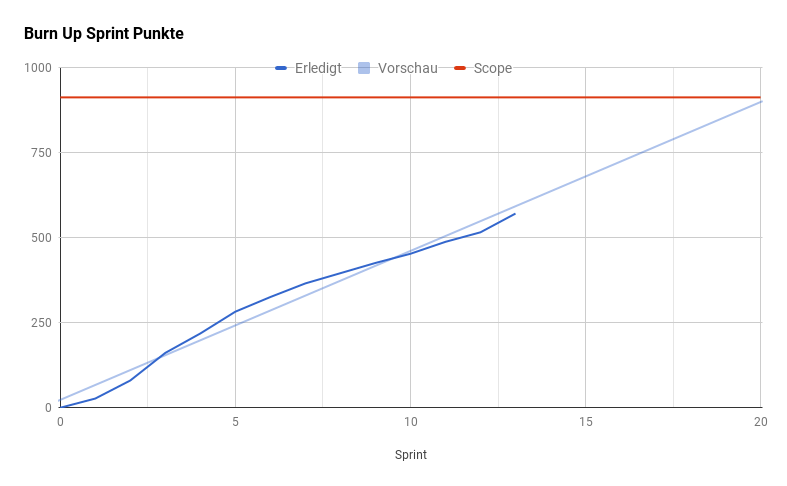

# Sprints

Übersicht der Sprints mit Link zur jeweiligen Präsentation, Protokoll und Burndown Chart.

| Startdatum | Präsentation                                                        | Protokoll                                                                                    | Burndown Chart                                                            | Abgeschlossene Tasks                                                       |
|------------|---------------------------------------------------------------------|----------------------------------------------------------------------------------------------|---------------------------------------------------------------------------|----------------------------------------------------------------------------|
| 2017-02-24 |                                                                     |                                                                                              | [Sprint 1 Burndown Chart](sprint-burndown-charts/sprint_01_burndown.png)  | [Sprint 1 Issues](https://github.com/IMSmobile/app/milestone/1?closed=1)   |
| 2017-03-10 |                                                                     |                                                                                              | [Sprint 2 Burndown Chart](sprint-burndown-charts/sprint_02_burndown.png)  | [Sprint 2 Issues](https://github.com/IMSmobile/app/milestone/2?closed=1)   |
| 2017-03-24 |                                                                     |                                                                                              | [Sprint 3 Burndown Chart](sprint-burndown-charts/sprint_03_burndown.png)  | [Sprint 3 Issues](https://github.com/IMSmobile/app/milestone/3?closed=1)   |
| 2017-04-07 | [Sprint 4 Review Präsentation](sprint-review/sprint_04_review.pdf)  | [Sprint 4 Review Protokoll](protocols/2017-04-21-presentation-sprint4-imagic_PICSystem.md)   | [Sprint 4 Burndown Chart](sprint-burndown-charts/sprint_04_burndown.png)  | [Sprint 4 Issues](https://github.com/IMSmobile/app/milestone/4?closed=1)   |
| 2017-04-21 | [Sprint 5 Review Präsentation](sprint-review/sprint_05_review.pdf)  | [Sprint 5 Review Protokoll](protocols/2017-05-05-presentation-sprint5-imagic_PICSystem.md)   | [Sprint 5 Burndown Chart](sprint-burndown-charts/sprint_05_burndown.png)  | [Sprint 5 Issues](https://github.com/IMSmobile/app/milestone/5?closed=1)   |
| 2017-05-05 | [Sprint 6 Review Präsentation](sprint-review/sprint_06_review.pdf)  | [Sprint 6 Review Protokoll](protocols/2017-05-19-presentation-sprint6-imagic_PICSystem.md)   | [Sprint 6 Burndown Chart](sprint-burndown-charts/sprint_06_burndown.png)  | [Sprint 6 Issues](https://github.com/IMSmobile/app/milestone/6?closed=1)   |
| 2017-05-19 | [Sprint 7 Review Präsentation](sprint-review/sprint_07_review.pdf)  | [Sprint 7 Review Protokoll](protocols/2017-06-02-presentation-sprint7-imagic_PICSystem.md)   | [Sprint 7 Burndown Chart](sprint-burndown-charts/sprint_07_burndown.png)  | [Sprint 7 Issues](https://github.com/IMSmobile/app/milestone/7?closed=1)   |
| 2017-06-02 | [Sprint 8 Review Präsentation](sprint-review/sprint_08_review.pdf)  | [Sprint 8 Review Protokoll](protocols/2017-06-16-presentation-sprint8-imagic_PICSystem.md)   | [Sprint 8 Burndown Chart](sprint-burndown-charts/sprint_08_burndown.png)  | [Sprint 8 Issues](https://github.com/IMSmobile/app/milestone/8?closed=1)   |
| 2017-06-16 | [Sprint 9 Review Präsentation](sprint-review/sprint_09_review.pdf)  | [Sprint 9 Review Protokoll](protocols/2017-06-30-presentation-sprint9-imagic_PICSystem.md)   | [Sprint 9 Burndown Chart](sprint-burndown-charts/sprint_09_burndown.png)  | [Sprint 9 Issues](https://github.com/IMSmobile/app/milestone/9?closed=1)   |
| 2017-06-30 | [Sprint 10 Review Präsentation](sprint-review/sprint_10_review.pdf) | [Sprint 10 Review Protokoll](protocols/2017-07-14-presentation-sprint10-imagic_PICSystem.md) | [Sprint 10 Burndown Chart](sprint-burndown-charts/sprint_10_burndown.png) | [Sprint 10 Issues](https://github.com/IMSmobile/app/milestone/10?closed=1) |
| 2017-07-14 | [Sprint 11 Review Präsentation](sprint-review/sprint_11_review.pdf) | [Sprint 11 Review Protokoll](protocols/2017-07-28-presentation-sprint11-imagic_PICSystem.md) | [Sprint 11 Burndown Chart](sprint-burndown-charts/sprint_11_burndown.png) | [Sprint 11 Issues](https://github.com/IMSmobile/app/milestone/11?closed=1) |
| 2017-07-28 | [Sprint 12 Review Präsentation](sprint-review/sprint_12_review.pdf) | [Sprint 12 Review Protokoll](protocols/2017-08-11-presentation-sprint12-imagic_PICSystem.md) | [Sprint 12 Burndown Chart](sprint-burndown-charts/sprint_12_burndown.png) | [Sprint 12 Issues](https://github.com/IMSmobile/app/milestone/12?closed=1) |
| 2017-08-11 | [Sprint 13 Review Präsentation](sprint-review/sprint_13_review.pdf) | [Sprint 13 Review Protokoll](protocols/2017-08-25-presentation-sprint13-imagic_PICSystem.md) | [Sprint 13 Burndown Chart](sprint-burndown-charts/sprint_13_burndown.png) | [Sprint 13 Issues](https://github.com/IMSmobile/app/milestone/13?closed=1) |

## Burn Up Chart
Auf dem Burn Up Chart erkennt man, dass im Backlog noch Arbeit bis zum Sprint 19 vorhanden ist.

