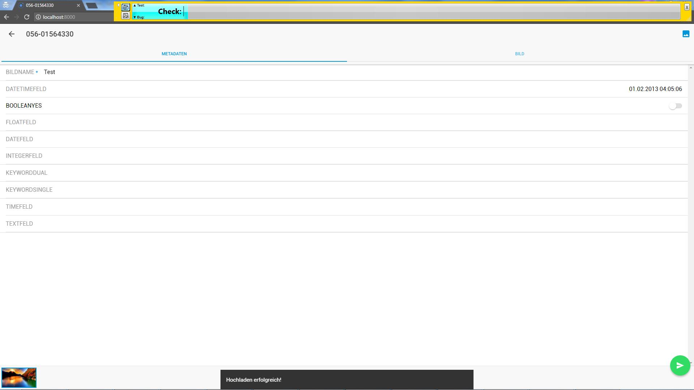

<h1>Session Report | Powered by <a href="http://testing.gershon.info/reporter/">Rapid Reporter</a></h1> 

<table
<tr class="Type"> <th>Time</th><th class="notetype">Type</th><th>Content</th><th>Screenshot&nbsp;</th></tr>
<tr class="(Rapid Reporter version)"> <td>14.08.2017 21:03:08</td><td class="notetype">(Rapid Reporter version)</td><td>1.16.05.20</td><td>&nbsp;</td></tr>
<tr class="Session Reporter"> <td>14.08.2017 21:03:08</td><td class="notetype">Session Reporter</td><td>&nbsp;</td></tr>
<tr class="Session Charter"> <td>14.08.2017 21:03:08</td><td class="notetype">Session Charter</td><td>Explore Settings with Web Browser iPhone and Android Phone to discover persistency or concurrency errors</td><td>&nbsp;</td></tr>
<tr class="Setup"> <td>14.08.2017 21:03:36</td><td class="notetype">Setup</td><td>Download and extract https://github.com/IMSmobile/app/archive/0.12.1.zip</td><td>&nbsp;</td></tr>
<tr class="Setup"> <td>14.08.2017 21:04:51</td><td class="notetype">Setup</td><td>Change into directory and run ''npm install''</td><td>&nbsp;</td></tr>
<tr class="Setup"> <td>14.08.2017 21:07:59</td><td class="notetype">Setup</td><td>Run command ''ionic cordova run browser'' / start app</td><td>&nbsp;</td></tr>
<tr class="Setup"> <t08.2017 21:18:17</td><td class="notetype">Setup</td><td>Open browser to http://localhost:8000/</td><td>&nbsp;</td></tr>
<tr class="Bug"> <td>14.08.2017 21:19:19</td><td class="notetype">Bug</td><td>Browser: Splash screen is missing logo</td><td>&nbsp;</td></tr>
<tr class="Setup"> <td>14.08.2017 21:19:42</td><td class="notetype">Setup</td><td>Login with account ''mia''</td><td>&nbsp;</td></tr>
<tr class="Setup"> <td>14.08.2017 21:20:27</td><td class="notetype">Setup</td><td>Select archive</td><td>&nbsp;</td></tr>
<tr class="Setup"> <td>14.08.2017 21:20:35</td><td class="notetype">Setup</td><td>Navigate to settings page</td><td>&nbsp;</td></tr>
<tr class="Test"> <td>14.08.2017 21:21:23</td><td class="notetype">Test</td><td>Check search in ''Bildupload Felder''</td><td>&nbsp;</td></tr>
<tr class="Note"> <td>14.08.2017 21:22:14</td><td class="notetype">Note</td><td>Enter ''k''</td><td>&nbsp;</td></tr>
<tr class="Check"> <td>14.08.2017 21:22:47</td><td class="notetype">Check</td><td>Three fields displayed on all devices</td><td>&nbsp;</td></tr>
<tr class="Test"> <td>14.08.2017 21:23:41</td><td class="notetype">Test</td><td>Enter ''*'' as search text as wildcard</td><td>&nbsp;</td></tr>
<tr class="Check"> <td>14.08.2017 21:23:55</td><td class="notetype">Check</td><td>No results</td><td>&nbsp;</td></tr>
<tr class="Test"> <td>14.08.2017 21:24:22</td><td class="notetype">Test</td><td>Enter ''test'' and press ''x'' (clear) button</td><td>&nbsp;</td></tr>
<tr class="Check"> <td>14.08.2017 21:24:50</td><td class="notetype">Check</td><td>All fields reappeard</td><td>&nbsp;</td></tr>
<tr class="Bug"> <td>14.08.2017 21:26:11</td><td class="notetype">Bug</td><td>iPhone only: Keyboard dissapears and reappears when clicking ''x''</td><td>&nbsp;</td></tr>
<tr class="Test"> <td>14.08.2017 21:27:04</td><td class="notetype">Test</td><td>Quickly click toggle button multiple times</td><td>&nbsp;</td></tr>
<tr class="Check"> <td>14.08.2017 21:28:04</td><td class="notetype">Check</td><td>Verify correct fields are active on upload page</td><td>&nbsp;</td></tr>
<tr class="Note"> <td>14.08.2017 21:29:15</td><td class="notetype">Note</td><td>Fields successfully shown on all devices</td><td>&nbsp;</td></tr>
<tr class="Test"> <td>14.08.2017 21:30:02</td><td class="notetype">Test</td><td>Disable URL field</td><td>&nbsp;</td></tr>
<tr class="Check"> <td>14.08.2017 21:30:43</td><td class="notetype">Check</td><td>Server Field is not displayed on all devices</td><td>&nbsp;</td></tr>
<tr class="Test"> <td>14.08.2017 21:31:36</td><td class="notetype">Test</td><td>Disable URL Field and immediately logout</td><td>&nbsp;</td></tr>
<tr class="Check"> <td>14.08.2017 21:32:21</td><td class="notetype">Check</td><td>Server Field is not displayed on all devices</td><td>&nbsp;</td></tr>
<tr class="Test"> <td>14.08.2017 21:32:45</td><td class="notetype">Test</td><td>Select all fields in ''Einträge Felder''</td><td>&nbsp;</td></tr>
<tr class="Check"> <td>14.08.2017 21:33:54</td><td class="notetype">Check</td><td>Compare entries list on all devices</td><td>&nbsp;</td></tr>
<tr class="Bug"> <td>14.08.2017 21:36:39</td><td class="notetype">Bug</td><td>Android Phone: scrolling in entries becomes very slow</td><td>&nbsp;</td></tr>
<tr class="Bug"> <td>14.08.2017 21:37:23</td><td class="notetype">Bug</td><td>iPhone: scrolling in entries results in app crash</td><td>&nbsp;</td></tr>
<tr class="Session End. Duration"> <td>14.08.2017 21:39:58</td><td class="notetype">Session End. Duration</td><td>00:36:50</td><td>&nbsp;</td></tr>
<tr class="(Rapid Reporter version)"> <td>14.08.2017 21:43:17</td><td class="notetype">(Rapid Reporter version)</td><td>1.16.05.20</td><td>&nbsp;</td></tr>
<tr class="Session Reporter"> <td>14.08.2017 21:43:17</td><td class="notetype">Session Reporter</td><td>&nbsp;</td></tr>
<tr class="Session Charter"> <td>14.08.2017 21:43:17</td><td class="notetype">Session Charter</td><td>Explore Upload with Web Browser iPhone and Android Phone to discover field validation</td><td>&nbsp;</td></tr>
<tr class="Setup"> <td>14.08.2017 21:43:36</td><td class="notetype">Setup</td><td>Same as in charter before</td><td>&nbsp;</td></tr>
<tr class="Setup"> <td>14.08.2017 21:43:57</td><td class="notetype">Setup</td><td>Start fresh browser in private mode</td><td>&nbsp;</td></tr>
<tr class="Setup"> <td>14.08.2017 21:44:16</td><td class="notetype">Setup</td><td>Login with account ''mia''</td><td>&nbsp;</td></tr>
<tr class="Setup"> <td>14.08.2017 21:47:06</td><td class="notetype">Setup</td><td>configure ''Bidlupload Felder'' of each type: DATETIMEFELD; BOOLEANYES; FLOATFELD; DATEFELD; INTEGERFELD; KEYWORDDUAL; KEYWORDSINGLE; TIMEFELD; TEXTFELD</td><td>&nbsp;</td></tr>
<tr class="Check"> <td>14.08.2017 21:47:24</td><td class="notetype">Check</td><td>Verify fields appear on upload page of a entry</td><td>&nbsp;</td></tr>
<tr class="Test"> <td>14.08.2017 21:48:35</td><td class="notetype">Test</td><td>DATETIMEFELD select and press cancel</td><td>&nbsp;</td></tr>
<tr class="Check"> <td>14.08.2017 21:49:11</td><td class="notetype">Check</td><td>Field stays empty on all devices</td><td>&nbsp;</td></tr>
<tr class="Note"> <td>14.08.2017 21:49:48</td><td class="notetype">Note</td><td>iPhone and Android Phone: year in DATETIME selection is not fully visible in portrait mode</td><td>&nbsp;</td></tr>
<tr class="Test"> <td>14.08.2017 21:50:48</td><td class="notetype">Test</td><td>DATETIMEFELD: Select 01.02.2003 04:06:06</td><td>&nbsp;</td></tr>
<tr class="Test"> <td>14.08.2017 21:51:18</td><td class="notetype">Test</td><td>Enter something into the mandatory field and press upload</td><td>&nbsp;</td></tr>
<tr class="Check"> <td>14.08.2017 21:52:41</td><td class="notetype">Check</td><td>Upload was successful on all devices</td><td>&nbsp;</td></tr>
<tr class="Check"> <td>14.08.2017 21:54:01</td><td class="notetype">Check</td><td>Date has arrived at IMS server</td><td>&nbsp;</td></tr>
<tr class="Note"> <td>14.08.2017 21:54:16</td><td class="notetype">Note</td><td>Time is in UTC; not local time</td><td>&nbsp;</td></tr>
<tr class="Test"> <td>14.08.2017 21:54:49</td><td class="notetype">Test</td><td>Select BOOLEANYES field to enable it</td><td>&nbsp;</td></tr>
<tr class="Check"> <td>14.08.2017 21:56:17</td><td class="notetype">Check</td><td>upload was successfull on all devices; BOOLEANYES field data was received by IMS server</td><td>&nbsp;</td></tr>
<tr class="Test"> <td>14.08.2017 21:56:30</td><td class="notetype">Test</td><td>FLOADFELD: enter ''abc'' as value and try to upload</td><td>&nbsp;</td></tr>
<tr class="Check"> <td>14.08.2017 21:57:05</td><td class="notetype">Check</td><td>All devices show warning about invalid fields</td><td>&nbsp;</td></tr>
<tr class="Test"> <td>14.08.2017 21:57:30</td><td class="notetype">Test</td><td>FLOATFELD: enter ''12.a'' as value and try to upload</td><td>&nbsp;</td></tr>
<tr class="Check"> <td>14.08.2017 21:58:17</td><td class="notetype">Check</td><td>All devices show warning about invalid fields</td><td>&nbsp;</td></tr>
<tr class="Test"> <td>14.08.2017 21:58:52</td><td class="notetype">Test</td><td>FLOATFELD: enter '' '' (space) as value and try to upload</td><td>&nbsp;</td></tr>
<tr class="Bug"> <td>14.08.2017 21:59:03</td><td class="notetype">Bug</td><td>FLOATFELD: Validation accepts '' '' (space) as a valid value</td><td>&nbsp;</td></tr>
<tr class="Bug"> <td>14.08.2017 21:59:26</td><td class="notetype">Bug</td><td>FLOATFELD: Error appears on all devices</td><td>&nbsp;</td></tr>
<tr class="Check"> <td>14.08.2017 22:00:37</td><td class="notetype">Check</td><td>FLOATFELD: enter ''1.23456789123456789123456789'' as value</td><td>&nbsp;</td></tr>
<tr class="Check"> <td>14.08.2017 22:01:09</td><td class="notetype">Check</td><td>Upload was successful on all devices</td><td>&nbsp;</td></tr>
<tr class="Check"> <td>14.08.2017 22:01:35</td><td class="notetype">Check</td><td>Value is truncated the same from all devices on IMS server</td><td>&nbsp;</td></tr>
<tr class="Test"> <td>14.08.2017 22:02:39</td><td class="notetype">Test</td><td>DATEFIELD: enter ''31.12.1917'' as value and try to upload</td><td>&nbsp;</td></tr>
<tr class="Check"> <td>14.08.2017 22:03:49</td><td class="notetype">Check</td><td>Upload was successful on all devices; DATEFIELD field data was received by IMS server</td><td>&nbsp;</td></tr>
<tr class="Test"> <td>14.08.2017 22:04:14</td><td class="notetype">Test</td><td>INTEGERFELD: enter ''0'' (zero) as value</td><td>&nbsp;</td></tr>
<tr class="Check"> <td>14.08.2017 22:05:18</td><td class="notetype">Check</td><td>INTEGERFELD: upload was successful on all devices and value is the same on IMS server</td><td>&nbsp;</td></tr>
<tr class="Check"> <td>14.08.2017 22:05:48</td><td class="notetype">Check</td><td>INTEGERFELD: enter ''-9999999999999'' as value</td><td>&nbsp;</td></tr>
<tr class="Bug"> <td>14.08.2017 22:06:26</td><td class="notetype">Bug</td><td>Upload fails on all devices with error</td><td>&nbsp;</td></tr>
<tr class="Check"> <td>14.08.2017 22:07:38</td><td class="notetype">Check</td><td>INTEGERFELD: enter ''ninethousand'' as value</td><td>&nbsp;</td></tr>
<tr class="Check"> <td>14.08.2017 22:08:03</td><td class="notetype">Check</td><td>validation check appears on all devices</td><td>&nbsp;</td></tr>
<tr class="Test"> <td>14.08.2017 22:09:21</td><td class="notetype">Test</td><td>KEYWORDDUAL: double tap/click on field</td><td>&nbsp;</td></tr>
<tr class="Bug"> <td>14.08.2017 22:10:37</td><td class="notetype">Bug</td><td>iPhone and Android Phone: keywordselection page is loaded twice</td><td>&nbsp;</td></tr>
<tr class="Note"> <td>14.08.2017 22:13:53</td><td class="notetype">Note</td><td>May be fixed by #592</td><td>&nbsp;</td></tr>
<tr class="Check"> <td>14.08.2017 22:14:58</td><td class="notetype">Check</td><td>KEYWORDDUAL: select ''99.'' as value</td><td>&nbsp;</td></tr>
<tr class="Check"> <td>14.08.2017 22:15:41</td><td class="notetype">Check</td><td>Upload was successful on all devices; KEYWORDDUAL field data has arrived on IMS server</td><td>&nbsp;</td></tr>
<tr class="Note"> <td>14.08.2017 22:17:42</td><td class="notetype">Note</td><td>Arkivar does not upload keyword fields the same as the full IMS client (only the last value; not with the full path)</td><td>&nbsp;</td></tr>
<tr class="Test"> <td>14.08.2017 22:18:14</td><td class="notetype">Test</td><td>KEYWORDSINGLE: select ''Radhaus hinten rechts'' as value</td><td>&nbsp;</td></tr>
<tr class="Check"> <td>14.08.2017 22:18:46</td><td class="notetype">Check</td><td>upload from all devices sucessful; KEYWORDSINGLE field data has arrived on IMS server</td><td>&nbsp;</td></tr>
<tr class="Test"> <td>14.08.2017 22:19:25</td><td class="notetype">Test</td><td>TIMEFELD: use ''23:59:59'' as value</td><td>&nbsp;</td></tr>
<tr class="Check"> <td>14.08.2017 22:19:55</td><td class="notetype">Check</td><td>all devices uploaded successfully; value arrived correctly at IMS server</td><td>&nbsp;</td></tr>
<tr class="Test"> <td>14.08.2017 22:20:39</td><td class="notetype">Test</td><td>TEXTFELD: enter very long string</td><td>&nbsp;</td></tr>
<tr class="Bug"> <td>14.08.2017 22:20:53</td><td class="notetype">Bug</td><td>Android Phone: field is not visible at all</td><td>&nbsp;</td></tr>
<tr class="Bug"> <td>14.08.2017 22:21:10</td><td class="notetype">Bug</td><td>iPhone: field only visible when starting to type</td><td>&nbsp;</td></tr>
<tr class="Bug"> <td>14.08.2017 22:23:37</td><td class="notetype">Bug</td><td>Browser: error appears when copying 100000 words into field</td><td>&nbsp;</td></tr>
<tr class="Bug"> <td>14.08.2017 22:24:29</td><td class="notetype">Bug</td><td>iPhone: text is hidden by big green upload button</td><td>&nbsp;</td></tr>
<tr class="Note"> <td>14.08.2017 22:24:60</td><td class="notetype">Note</td><td>Time is up; good work everyone!</td><td>&nbsp;</td></tr>
<tr class="Session End. Duration"> <td>14.08.2017 22:24:56</td><td class="notetype">Session End. Duration</td><td>00:41:38</td><td>&nbsp;</td></tr>

</table>